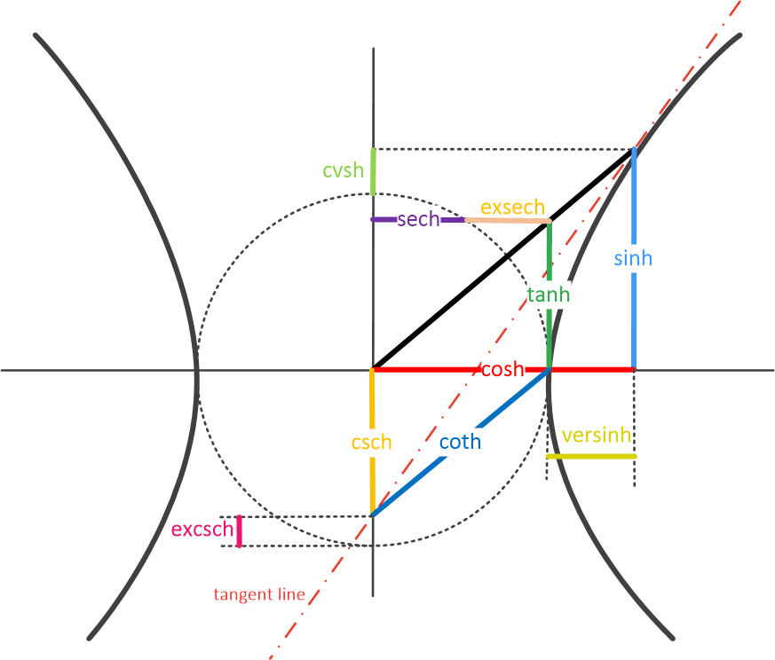
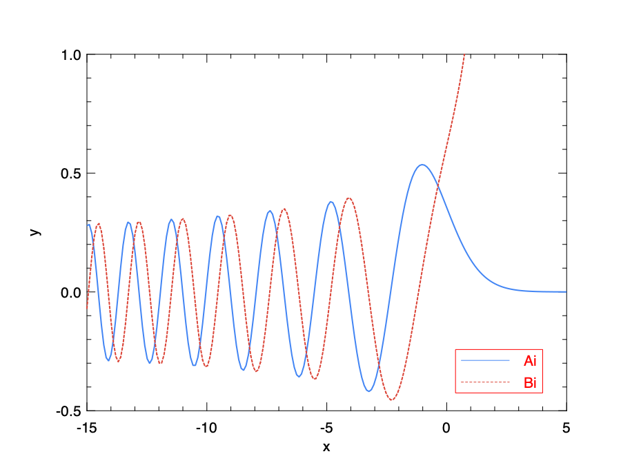
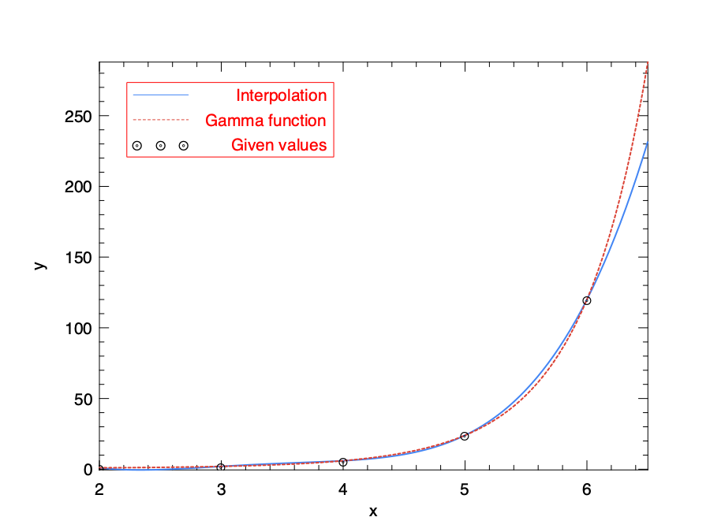

# Mathematical Functions

Staring from this chapter, we begin our journey to explore the world of numerical computing with Owl. 
But let's not be hasty. Before the main dishes such as algorithmic differentiation, optimisation, computation graph, etc., let's taste some starters first.
In this chapter, we will introduce how the familiar mathematical operations are supported in Owl.
This chapter is organised according to different types of functions, and you can feel free to browse any of them. 
Note that functions in this chapter works on scalar values.
The N-dimensional array module introduced in later chapters contains these basic functions that work on n-dimensional arrays, including vectors and matrices.

## Basic Functions

### Basic Unary Math Functions

Many basic mathematic functions take one float number as input and return one float number. We call them *unary* functions.
You can use these unary functions easily from the `Maths` module. For example:

```ocaml
# Maths.sqrt 2.
- : float = 1.41421356237309515
```

The [@tbl:maths:basic_unary] lists these unary functions supported in this module. 

------------  -------------------------------------------------------
Function      Explanation
------------  -------------------------------------------------------
`abs`         `|x|`

`neg`         `-x`

`reci`        `1/x`

`floor`       the largest integer that is smaller than `x`

`ceil`        the smallest integer that is larger than `x`

`round`       rounds `x` towards the bigger integer when on the fence

`trunc`       integer part of `x`

`sqr`         $x^2$

`sqrt`        $\sqrt{x}$
------------  -------------------------------------------------------
: Basic unary math functions {#tbl:maths:basic_unary}

### Basic Binary Functions

Unlike the unary ones, the *binary functions* take two floats as inputs and return one float as output. 
Most common arithmetic functions belong to this category, as shown in [@tbl:maths:binary].

------------  -------------------------------------------------------
Function      Explanation
------------  -------------------------------------------------------
`add`         `x + y`

`sub`         `x - y`

`mul`         `x * y`

`div`         `x / y`

`fmod`        `x % y`

`pow`         $x^y$

`hypot`       $\sqrt{x^2 + y^2}$

`atan2`       returns $\arctan(y/x)$, accounting for the sign of the
              arguments; this is the angle to the vector $(x, y)$ counting from the x-axis.
------------  -------------------------------------------------------
: Binary math functions {#tbl:maths:binary}

### Exponential and Logarithmic Functions

The constant $e = \sum_{n=0}^{\infty}\frac{1}{n!}$ is what we call the *natural constant*.
It is named this way because the exponential function and its inverse function logarithm are so frequently used in nature and our daily life: logarithmic spiral, population growth, carbon date ancient artifacts, computing bank investments, etc.
As an example, in a scientific experiment about bacteria, we can assume the number of bacterial at time $t$ follows an exponential function $n(t) = Ce^rt$ where $C$ is the initial population and $r$ is the daily increase rate.
With this model, we can predict how the population of bacterial grows within certain time.

We also have this beautiful Euler's formula that connects the two most frequently used constants and the base of complex numbers and natural numbers:

$$e^{i\pi}+ 1=0.$$

The full list of exponential and logarithmic functions, together with some handy variants, are presented in [@tbl:maths:explog].

------------  -------------------------------------------------------
Function      Explanation
------------  -------------------------------------------------------
`exp`         exponential $e^x$

`exp2`        $2^x$

`exp10`       $10^x$

`expm1`       returns $\exp(x) - 1$ but more accurate for $x \sim 0$

`log`         $\log_e~x$

`log2`        $\log_2~x$

`log10`       $\log_10~x$

`logn`        $\log_n~x$

`log1p`       inverse of `expm1`

`logabs`      $\log(|x|)$

`xlogy`       $x \log(y)$

`xlog1py`     $x \log(y+1)$

`logit`       $\log(p/(1-p))$

`expit`       $1/(1+\exp(-x))$

`log1mexp`    $\log(1-\exp(x))$

`log1pexp`    $\log(1+\exp(x))$
------------  -------------------------------------------------------
: Exponential and logarithmic math functions {#tbl:maths:explog}

### Trigonometric Functions

The sine, cosine, and tangent functions belong to the *trigonometric functions*, which relate ratios of two side lengths to an angle of a right-angled triangle. They include the commonly used `sin` and `cos` etc., and their reciprocals such as the cosecant, secant, etc. 
These functions are widely used in the numerical computation applications of different fields, such as mechanics and geometry. 
The triangular functions are all unary functions, for example:

```ocaml
# Maths.sin (Owl_const.pi /. 2.)
- : float = 1.
```

They are all included in the math module in Owl, as shown in [@tbl:maths:triangular].

------------  ---------------- -----------------                  ---------------------------------------------
Function      Explanation      Derivatives                        Taylor Expansion
------------  ---------------- -----------------                  ---------------------------------------------
`sin`         $\sin(x)$        $\cos(x)$                          $\sum_{n=1}(-1)^{n+1}\frac{x^{2n+1}}{(2n+1)!}$

`cos`         $\cos(x)$        $-\sin(x)$                         $\sum_{n=1}(-1)^n\frac{x^{2n}}{(2n)!}$

`tan`         $\tan(x)$        $1 + \tan^2(x)$                    $\sum_{n=1}\frac{4^n(4^n-1)B_n~x^{2n-1}}{(2n)!}$

`cot`         $1/\tan(x)$      $-(1 + \textrm{cot}^2(x))$         $\sum_{n=0}\frac{E_n~x^{2n}}{(2n)!}$

`sec`         $1/\cos(x)$      $\textrm{sec}(x)\tan(x)$           $\sum_{n=0}\frac{2(2^{2n-1})B_n~x^{2n-1}}{(2n)!}$

`csc`         $1/\sin(x)$      $-\textrm{csc}(x)\textrm{cot}(x)$  $\frac{1}{x}-\sum_{n=1}\frac{4^n~B_n~x^{2n-1}}{(2n)!}$
------------  ---------------- -----------------                  ---------------------------------------------
: Trigonometric math functions {#tbl:maths:triangular}

Here the $B_n$ is the $n$th [Bernoulli number](https://en.wikipedia.org/wiki/Bernoulli_number), and $E_n$ is the $n$th [Euler number](https://en.wikipedia.org/wiki/Euler_number).
The [@fig:algodiff:trio] shows the relationship between these trigonometric functions. This figure is inspired by a [wiki post](https://zh.wikipedia.org/wiki/%E5%8F%8C%E6%9B%B2%E5%87%BD%E6%95%B0).
These functions also have corresponding inverse functions: `asin`, `acos`, `atan`, `acot`, `asec`, `acsc`. For example, if $\sin(a) = b$, then $\textrm{asin}(b) = a$.

{width=60% #fig:algodiff:trio}

Another related idea is the *Hyperbolic functions* such as `sinh` and `cosh`.
These functions are defined using exponential functions.
We have seen in [@#fig:algodiff:trio] that the trigonometric functions are related to a circle. Similarly, the hyperbolic functions are related to a hyperbola. 
For example, the points `(cosh(x), sinh(x))` form the right half of the equilateral hyperbola, just like `(cos(x), sin(x))` on a circle.
The hyperbolic functions is applied widely in numerical computing, such as in the differential equation solutions, hyperbolic geometry, etc.   
These functions in Owl are shown below:

- `sinh`: $\frac{e^x - e^{-x}}{2}$, derivative is $\cosh(x)$, and taylor expansion is $\sum_{n=0}\frac{x^{2n+1}}{(2n+1)!}$.
- `cosh`: $\frac{e^x + e^{-x}}{2}$, derivative is $\sinh(x)$, and taylor expansion is $\sum_{n=0}\frac{x^{2n+1}}{(2n+1)!}$.
- `tanh`: $\frac{\sinh{x}}{\cosh{x}}$, derivative is $1-\tanh^2(x)$, and taylor expansion is $\sum_{n=1}\frac{4^n(4^n-1)B_{2n}~x^{2n-1}}{(2n)!}$.
- `coth`: $\frac{\cosh{x}}{\sinh{x}}$, derivative is $1-\coth^2(x)$, and taylor expansion is $\frac{1}{x}-\sum_{n=1}\frac{4^n~B_{2n}~x^{2n-1}}{(2n)!}$.
- `sech`: $1/\cosh(x)$, derivative is $-\tanh(x)/\cosh(x)$, and taylor expansion is $\sum_{n=0}\frac{E_{2n}~x^{2n}}{(2n)!}$.
- `csch`:$1/\sinh(x)$, derivative is $-\coth(x)/\sinh(x)$, and taylor expansion is $\frac{1}{x}+\sum_{n=1}\frac{2(1-2^{2n-1})B_{2n}~x^{2n-1}}{(2n)!}$.

Similarly, each of these functions has a corresponding inverse functions: `asinh`, `acosh`, `atanh`, `acoth`, `asech`, `acsch`.
The relationship between these hyperbolic trigonometric functions are clearly depicted in [@fig:algodiff:hyper_trio].

{width=70% #fig:algodiff:hyper_trio}

Besides these functions, there are also some related functions.
`sinc` returns $\sin(x)/x$ and 1 for $x=0$.
`logsinh` returns $\log(\sinh(x))$ but handles large $|x|$.
`logcosh` returns $\log(\cosh(x))$ but handles large $|x|$.
`sindg`/`cosdg`/`tandg`/`cotdg` are the sine/cosine/tangent/cotangent of the angle given in degrees.

### Other Math Functions

There are some other functions that may not be very commonly used in traditional mathematics.
Functions such as `sigmoid` and `relu` are frequently used in the Deep Learning as the activation functions in a neural network.
The activation functions are crucial to the neural network regarding various aspects, including output result, accuracy, convergence speed, etc.
We will talk about them in detail in the Neural Network chapter later in this book. 

- `sigmoid x`: $1 / (1 + \exp(-x))$
- `signum x`: returns the sign of `x`: -1, 0, or 1
- `softsign x`: smooths `sign` function
- `relu x`: $\max(0, x)$

## Special Functions

Besides what we have just listed, there are also a lot special functions. You may not heard of them before, but they have established names and are important in different fields such as mathematical analysis, physics, etc. 
In Owl, the implementations of these functions rely on the [Cephes Mathematical Functions Library](http://www.netlib.org/cephes/), a C language library with special functions of interest to scientists and engineers.
They are list in the rest of this section. Perhaps we cannot dig deep into the mathematical or physical implication of all these functions, but you may find them handy when you need one.

### Airy Functions

The Airy function `Ai(x)` is named after the British astronomer George B. Airy. 
It is the solution of the second order linear differential equation:

$$y''(x) = xy(x).$$

This differential equation has two linearly independent solutions `Ai` and `Bi`.
Owl provides the `airy` function to do that:

```
val airy : float -> float * float * float * float
```

The four returned numbers are `Ai`, its derivative `Ai'`, `Bi`, and its derivative `Bi'`.
Let's look at an example.
It plots the two solutions `Ai` and `Bi` in [@fig:algodiff:airy].

```ocaml
let x = Mat.linspace (-15.) 5. 200

let y0 = Mat.map (fun x ->
	let ai, _, _, _ = Maths.airy x in ai
) x

let y1 = Mat.map (fun x ->
	let _, _, bi, _ = Maths.airy x in bi
) x

let _ =
  let h = Plot.create "special_airy.png" in
  Plot.(plot ~h ~spec:[ RGB (66, 133, 244); LineStyle 1; LineWidth 2. ] x y0);
  Plot.(plot ~h ~spec:[ RGB (219, 68,  55); LineStyle 2; LineWidth 2. ] x y1);
  Plot.(set_yrange h (-0.5) 1.);
  Plot.(legend_on h ~position:SouthEast [|"Ai"; "Bi"|]);
  Plot.output h
```

{width=60% #fig:algodiff:airy}


### Bessel Functions

Bessel functions, first defined by the mathematician Daniel Bernoulli and then generalized by Friedrich Bessel, are canonical solutions of Bessel's differential equation:

$$x^2y''+xy'+(x^2 - \alpha^2)y = 0.$$

The complex number $\alpha$ is called the "order" of the bessel function.
Bessel functions are important for many problems in studying the wave propagation and static potentials, such as electromagnetic waves in a cylindrical waveguide. 
In solving cylindrical coordinate systems, Bessel functions of integer order or half integer order are often used. 

The Bessel functions can be divided into two kinds. Both kinds are solutions to the Bessel's differential equations, but the first kind is non-singular at the origin, while the second kind is singular at the origin ($x=0$).
A special case is when $x$ is purely imaginary. In this case, the solutions are called the modified Bessel functions, which can also be categorised into first kind and second kind.
Based on these category, Owl provides these functions.

-------- ---------------------------------------------
Function Explanation
-------- ---------------------------------------------
`j0 x`   Bessel function of the first kind of order 0

`j1 x`   Bessel function of the first kind of order 1

`jv x y` Bessel function of the first kind of real order

`y0 x`   Bessel function of the second kind of order 0

`y1 x`   Bessel function of the second kind of order 1

`yv x y` Bessel function of the second kind of real order

`yn a x` Bessel function of the second kind of integer order

`i0 x`   Modified Bessel function of order 0

`i1 x`   Modified Bessel function of order 1

`iv x y` Modified Bessel function of real order

`i0e x`  Exponentially scaled modified Bessel function of order 0

`i1e x`  Exponentially scaled modified Bessel function of order 1

`k0 x`   Modified Bessel function of the second kind of order 0

`k1`     Modified Bessel function of the second kind of order 1

`k0e`    Exponentially scaled modified Bessel function of the second kind of order 0

`k1e`    Exponentially scaled modified Bessel function of the second kind of order 1
-------- ---------------------------------------------
: Bessel functions {#tbl:maths:bessel}

In the example below, we plot the first kind Bessel function of order 0, 1, and 2, as shown in [@fig:algodiff:bessel].

```ocaml
let x = Mat.linspace (0.) 20. 200

let y0 = Mat.map Maths.j0 x

let y1 = Mat.map Maths.j1 x

let y2 = Mat.map (Maths.jv 2.) x

let _ =
  let h = Plot.create "example_bessel.png" in
  Plot.(plot ~h ~spec:[ RGB (66, 133, 244); LineStyle 1; LineWidth 2. ] x y0);
  Plot.(plot ~h ~spec:[ RGB (219, 68,  55); LineStyle 2; LineWidth 2. ] x y1);
  Plot.(plot ~h ~spec:[ RGB (244, 180,  0); LineStyle 3; LineWidth 2. ] x y2);
  Plot.(legend_on h ~position:NorthEast [|"j0"; "j1"; "j2"|]);
  Plot.output h
```

{width=60% #fig:algodiff:bessel}


### Elliptic Functions

The *Jacobian elliptic functions* are used in studying the pendulum motion.
There are twelve Jacobi elliptic functions and `ellipj` we include here in Owl returns three of them: `sn`, `cn`, and `dn`. The fourth output `phi` of this function is called the amplitude of input `u`. 

On the other hand, the *Elliptic integrals* are initially used to find the perimeters of ellipses. 
A Elliptic integral function can be expressed in the form of:
$$f(x)=\int_c^xR(t, \sqrt(P(t)))dt,$$
where $R$ is a rational function of its two arguments, $P$ is a polynomial of degree 3 or 4 with no repeated roots, and $c$ is a constant.
An elliptic integral can be categorised as "complete" or "incomplete".
The former one is function of a single argument, while the latter contains two arguments.
Each elliptic integral can be transformed so that it contains integrals of rational functions and the three Legendre canonical forms, according to which the elliptic can be categorised into the first, second, and third kind. 
The elliptic functions in Owl are listed in [@tbl:maths:elliptic].

---------------------- -----------------------------------------------------------------------------------
Function               Explanation
---------------------- -----------------------------------------------------------------------------------
`ellipj u m`           Jacobian elliptic functions of parameter `m` between 0 and 1, and real argument `u`

`ellipk m`             Complete elliptic integral of the first kind

`ellipkm1 p`           Complete elliptic integral of the first kind around m = 1

`ellipkinc phi m`      Incomplete elliptic integral of the first kind

`ellipe m`             Complete elliptic integral of the second kind

`ellipeinc phi m`      Incomplete elliptic integral of the second kind
---------------------- -----------------------------------------------------------------------------------
: Elliptic functions {#tbl:maths:elliptic}


We can use `ellipe` to compute the circumference of an ellipse. To compute that normally requires calculus, but the elliptic functions provides a simple solution.
Suppose an ellipse has semi-major axis $a=4$ and semi-minor axis $b=3$. We an compute its circumference simply using $4a\textrm{ellipe}(1 - \frac{b^2}{a^2})$.

```ocaml
# let a = 4.
val a : float = 4.
# let b = 3.
val b : float = 3.
# let c = 4. *. a *. Maths.(ellipe (1. -. pow (b /. a) 2.))
val c : float = 22.1034921607095072
```

### Gamma Functions

For a positive integer n, the *Gamma function* is the factorial function:

$$\Gamma(n) = (n-1)!$$

For a complex numbers $z$ with a positive real part, the Gamma function is defined as:

$$\Gamma(z) = \int_0^{\infty}x^{z-1}e^{-x}dx.$$


Here the gamma function is an integral from zero to infinity. If we change it to an integral from zero to a certain upper limit, it is called the "lower incomplete gamma function". 
Similarly, if it is an integral from a certain lower limit to infinity, the integral is called the "upper incomplete gamma function".

The Gamma function is widely used in a range of areas such as fluid dynamics, geometry, astrophysics, etc. It is especially suitable for describing a common pattern of processes that decay exponentially in time or space.
The Gamma function and related function provided in Owl are listed in [@tbl:maths:gamma].

------------------------- ------------------------------------------------------
Function                  Explanation
------------------------- ------------------------------------------------------
`gamma z`                 Returns the value of the Gamma function

`rgamma z`                Reciprocal of the Gamma function

`loggamma z`              Principal branch of the logarithm of the Gamma function

`gammainc a x`            Regularized lower incomplete gamma function

`gammaincinv a y`         Inverse function of `gammainc`

`gammaincc a x`           Complemented incomplete gamma integral

`gammainccinv a y`        Inverse function of `gammaincc`

`psi z`                   The digamma function
------------------------- ------------------------------------------------------
: Gamma functions {#tbl:maths:gamma}

Here is an example of using `gamma`.

```ocaml
let x = Mat.linspace (-3.5) 5. 2000

let y = Mat.map Maths.gamma x

let _ =
  let h = Plot.create "example_gamma.png" in
  Plot.(plot ~h ~spec:[ RGB (66, 133, 244); LineStyle 1; LineWidth 2. ] x y);
  Plot.(set_yrange h (-10.) 20.);
  Plot.output h
```

{width=60% #fig:algodiff:gamma}


### Beta Functions

Beta function is defined as:

$$B(x,y) = \int_0^1t^{x-1}(1-t)^{y-1}dt = \frac{\Gamma(x)\Gamma(y)}{\Gamma(x+y)}$$

Here $\Gamma$ is the Gamma function, and similar to it, the Beta function has its "incomplete" version. 
The incomplete Beta function extends this definition to:

$$B(x, a, b) = \int_0^xt^{a-1}(1-t)^{b-1}dt.$$

In Owl the Beta function is called using the `beta x y` function from the `Maths` module, and its incomplete version is `betainc a b x`.
We also provide the `betaincinv` function, which is the inverse of `betainc`.

The Beta function has several properties.
For example, the code below shows the relationship between beta function and gamma function.

```ocaml
# let x = Maths.beta 3. 4.
val x : float = 0.0166666666666666664
# let y = Maths.((gamma 3.) *. (gamma 4.) /. (gamma (7.)))
val y : float = 0.0166666666666666664
```

Another property is its symmetricity, which means $B(x,y) = B(y, x)$.

```ocaml
# let x = Maths.beta 3. 4.
val x : float = 0.0166666666666666664
# let y = Maths.beta 4. 3.
val y : float = 0.0166666666666666664
```

Beta function is the first known scattering amplitude in the String theory in physics. 
It is also used in the analysis of the preferential attachment process, a type of stochastic urn process that describes how the resource can be distributed among a group of individuals based on the existing resource each one has acquired. 

### Struve Functions

The *Struve function* is defined as:
$$H_v(x) = (z/2)^{v + 1} \sum_{n=0}^\infty \frac{(-1)^n (z/2)^{2n}}{\Gamma(n + \frac{3}{2}) \Gamma(n + v + \frac{3}{2})},$$

where $\Gamma$ is the Gamma function. $x$ must be positive unless $v$ is an integer.
Struve functions are used across a wide variety of physics applications, such as water-wave problems and calculations in unsteady aerodynamics.

The Owl function `struve v x` returns the value of Struve function. The parameter $v$ is called the *order* of this function.
Here is an example that shows the curves of Struve functions with order from 0 to 4.

```ocaml
let _ =
  let h = Plot.create "example_struve.png" in
  Plot.(plot_fun ~h ~spec:[ RGB (66, 133, 244); LineStyle 1; LineWidth 2.] (Maths.struve 0.) (-12.) 12.);
  Plot.(plot_fun ~h ~spec:[ RGB (219, 68,  55); LineStyle 2; LineWidth 2.] (Maths.struve 1.) (-12.) 12.);
  Plot.(plot_fun ~h ~spec:[ RGB (244, 180,  0); LineStyle 3; LineWidth 2.] (Maths.struve 2.) (-12.) 12.);
  Plot.(plot_fun ~h ~spec:[ RGB (77,  81,  57); LineStyle 1; LineWidth 2.] (Maths.struve 3.) (-12.) 12.);
  Plot.(plot_fun ~h ~spec:[ RGB (111, 51, 129); LineStyle 2; LineWidth 2.] (Maths.struve 4.) (-12.) 12.);
  Plot.(set_yrange h (-3.) 5.);
  Plot.(legend_on h ~position:SouthEast [|"H0"; "H1"; "H2"; "H3"; "H4"|]);
  Plot.output h
```

{width=60% #fig:algodiff:struve}


### Zeta Functions

The *Hurwitz zeta function* `zeta x q` is defined as:

$$\zeta(x, q) = \sum_{k=0}^{\infty}\frac{1}{(k+q)^x}.$$

When $q$ is set to 1, this function is reduced to the *Riemann zeta function*.
The function `zetac x` returns Riemann zeta function minus 1.
The zeta function is often used to analyse the dynamic systems.
Besides, the Riemann zeta function plays an important role in number theory and is widely applied in quantum physics, probability theory, and applied statistics, etc. 

We can evaluate the zeta function at certain points, for example:

```ocaml
# Maths.zeta 4. 1.
- : float = 1.08232323371113837

# (Maths.pow Owl_const.pi 4.) /. 90.
- : float = 1.08232323371113792
```

### Error Functions

The error functions here are not about error processing in programming, but yet another family of special functions.
In mathematics, an error function is defined as:
$$\frac{2}{\sqrt{\pi}}\int_0^x e^{-t^2})dt.$$

The error function occurs often in probability and statistics. Actually, in statistics, for a non-negative value `x`, `erf x` is the probability that a random variable `y` falls in the range `[-x, x]`. Here `y` follows a normal distribution with mean 0 and variance 0.5.
Since it represents certain probability, the *complementary* error function `1 - erf(x)` is also frequently used.
The error function and related variants in Owl are listed in [@tbl:maths:error].

------------------------- ------------------------------------------------------
Function                  Explanation
------------------------- ------------------------------------------------------
`erf x`                   Error function

`erfc x`                  Complementary error function: $1 - \textrm{erf}(x)$

`erfcx x`                 Scaled complementary error function: $\exp(x^2) \mathrm{erfc}(x)$

`erfinv x`                Inverse function of `erf`

`erfcinv x`               Inverse function of `erfc`
------------------------- ------------------------------------------------------
: Error functions {#tbl:maths:error}

The error function is a sigmoid function. We can observe its shape by the code below.

```ocaml
let _ =
  let h = Plot.create "example_erf.png" in
  Plot.(plot_fun ~h ~spec:[ RGB (66, 133, 244); LineStyle 1; LineWidth 2.] Maths.erf (-3.) 3.);
  Plot.output h
```

{width=75% #fig:algodiff:erf}

### Integral Functions

Besides what we have mentioned so far, Owl also provides several special integral functions.

For example, the *Dawson function* is defined as:
$$D(x) = e^{-x^2}\int_0^x~e^{t^2}dt$$

And the *Fresnel trigonometric integral* returns a tuple that contains two parts:
$$S(x) = \int_0^x~sin(t^2)dt, C(x) = \int_0^x~cos(t^2)dt.$$

Just like many otheer special functions, these two types of inegrals are motivated by research in physics, such as the electromagnetic problems.
They are provided by the `dawsn` and `fresnel` functions in the `Maths` module respecitively.
We can observe the functions of these integrals with plots.

```ocaml
let _ =
  let h = Plot.create ~m:1 ~n:2 "example_integrals.png" in
  Plot.subplot h 0 0;
  Plot.(plot_fun ~h ~spec:[ RGB (66, 133, 244); LineStyle 1; LineWidth 2.] Maths.dawsn (-5.) 5.);
  Plot.set_ylabel h "dawsn(x)";
  Plot.subplot h 0 1;
  Plot.(plot_fun ~h ~spec:[ RGB (66, 133, 244); LineStyle 1; LineWidth 2.] (fun x -> let s, _ = Maths.fresnel x in s) 0. 5.);
  Plot.(plot_fun ~h ~spec:[ RGB (219, 68,  55); LineStyle 2; LineWidth 2.] (fun x -> let _, c = Maths.fresnel x in c) 0. 5.);
  Plot.(legend_on h ~position:SouthEast [|"S(x)"; "C(x)"|]);
  Plot.set_ylabel h "fresnel(x)";
  Plot.output h
```

{width=100% #fig:algodiff:integrals}

Besides these two, several other type of special integral functions are also provided. The full list is shown in [@tbl:maths:integral].

----------------- -----------------------------------------------------------
Function          Explanation
----------------- -----------------------------------------------------------
`expn n x`        Generalized exponential integral $E_n(x) = x^{n-1}\int_x^{\infty}\frac{e^{-t}}{t^n}dt$

`shi x`           Hyperbolic sine integral: $\int_0^x~\frac{\sinh~t}{t}dt$

`chi x`           Hyperbolic cosine integral: $\gamma + \log(x) + \int_0^x~\frac{\cosh~t -1}{t}dt$

`shichi x`        (`shi x`, `chi x`)

`si x`            Sine integral: $\int_0^x~\frac{\sin~t}{t}dt$

`ci x`            Cosine integral: $\gamma + \log(x) + \int_0^x~\frac{\cos~t -1}{t}dt$

`sici x`          (`si x`, `ci x`)
----------------- -----------------------------------------------------------
: Special integral functions {#tbl:maths:integral}


## Factorials

After the functions, let's turn to a concept that we are familiar with: the *factorials*. 
The definition of factorials is simple:

$F(n) = n! = n \times (n - 1) \times (n-2) \ldots \times 1$

The factorial function, together with several of its variants, are contained in the `Math` module.

----------------- -----------------------------------------------------------
Function          Explanation
----------------- -----------------------------------------------------------
`fact n`          Factorial function $!n$

`log_fact n`      Logarithm of factorial function

`doublefact n`    Double factorial function calculates $n!! = n(n-2)(n-4)\dots 2$ (or 1)

`log_doublefact n` Logarithm of double factorial function
----------------- -----------------------------------------------------------
: Factorial functions {#tbl:maths:factorial}

The factorial functions accepts integer as input, for example:

```ocaml
# Maths.fact 5
- : float = 120.
```

The factorials are applied in many areas of mathematics, most notably the combinatorics.
The permutation and combination are both defined in factorials.
The permutation function returns the number $n!/(n-k)!$ of ordered subsets of length $k$, taken from a set of $n$ elements.
The combination function returns the number ${n\choose k} = n!/(k!(n-k)!)$ of subsets of $k$ elements of a set of $n$ elements.
[@tbl:maths:perm] provides the combinatorics functions you can use in the `Math` module.


----------------------  -----------------------------------------------------------
Function                Explanation
----------------------  -----------------------------------------------------------
`permutation n k`       Permutation number

`permutation_float n k` Similar to `permutation` but deals with larger range and returns float

`combination n k`       Combination number

`combination_float n k` Similar to `combination` but deals with larger range and returns float

`log_combination n k`   Returns the logarithm of ${n\choose k}$
----------------------  -----------------------------------------------------------
: Permutation and combination functions {#tbl:maths:perm}

Let's take a look at a simple example.

```ocaml
# let x = Maths.combination 10 2
val x : int = 45
# let y = Maths.combination_float 10 2
val y : float = 45.
```

## Interpolation and Extrapolation

Sometimes we don't know the full description of a function $f$, but only some points on it, and therefore we cannot calculate its value at an aribitrary point.
The target is to esimate the $f(x)$ for an arbitrary $x$ by drawing a smooth curve through the given data. If $x$ is within the range of the given data, this taks is called *interpolation*, otherwise it's called *extrapolation*, which is much more difficult to do.

The `Owl_maths_interpolate` module provides an `polint` function for interpolation and extrapolation:

```
val polint : float array -> float array -> float -> float * float
```

The function `polint xs ys x` performs polynomial interpolation of the given arrays `xs` and `ys`. 
Given arrays $xs[0 \ldots (n-1)]$ and $ys[0\ldots~(n-1)]$, and a value `x`, this function returns a value `y`, and an error estimate `dy`.

As its name suggests, the `polint` approximates complicated curves with polynomial of the lowest possible degree that passes the given points.
We show how this interplation method works with an example.
In the previous section we have said that the Gamma function is actually an interpolation solution to the integer function $y(x) = (n-1)!$.
So we can specify five nodes on a plane that are generated from this factorial functions, and see how the interpolation function works compared with the Gamma function itself. 

```ocaml env=maths:interp
# let x = [|2; 3; 4; 5; 6|]
val x : int array = [|2; 3; 4; 5; 6|]
# let y = Array.map (fun x -> Maths.fact (x - 1)) x
val y : float array = [|1.; 2.; 6.; 24.; 120.|]
# let x = Array.map float_of_int x
val x : float array = [|2.; 3.; 4.; 5.; 6.|]
```

Now we can define the interpolation function `f` that accepts one float number and returns another float number.
Also we convert the given data $x$ and $y$ into matrix format for plotting purpose.

```ocaml env=maths:interp
let f a =
  let v, _ = Owl_maths_interpolate.polint x y a in
  v

let xm = Mat.of_array x 1 5
let ym = Mat.of_array y 1 5
```

Now we can plot the interpolation function and compare it to the Gamma function.
As can be seen in [@fig:maths:interp], both lines cross the given nodes. The interpolated line fits well with the "true interpolation", i.e. the Gamma function, within a certain range. 
However, the extrapolation fitting where the x-value falls out of given data, is less than ideal.

```ocaml env=maths:interp
let _ =
  let h = Plot.create "interp.png" in
  Plot.(plot_fun ~h ~spec:[ RGB (66, 133, 244); LineStyle 1; LineWidth 2.] f 2. 6.5);
  Plot.(plot_fun ~h ~spec:[ RGB (219, 68,  55); LineStyle 2; LineWidth 2.] Maths.gamma 2. 6.5);
  Plot.(scatter ~h ~spec:[ Marker "#[0x229a]"; MarkerSize 5. ] xm ym);
  Plot.(legend_on h ~position:NorthWest [|"Interpolation"; "Gamma function"; "Given values"|]);
  Plot.output h
```

{width=60% #fig:maths:interp}

## Integration

We have introduced some special integral functions, but we still need general integration methods that work for any input functions. 
Given a function $f$ that accepts a real variable and an interval $[a, b]$ of the real line, the integral of this function

$$\int_a^bf(x)dx$$

can be thought of as the sum of signed area of the region in the cartesian plane that is bounded by the curve of f, the x-axis within the x-axis range $[a, b]$. The area above the x-axis adds to the sum and that below the x-axis subtracts from the area sum.

In the `Owl_maths_quandrature` module, Owl provides several neumerical routines to help you to do integrations. For example, we can compute  $\int_1^4x^2$ with the code below:

```ocaml
# Owl_maths_quadrature.trapz (fun x -> x ** 2.) 1. 4.
- : float = 21.0001344681758439
```

We can verify this result using the fundamental theorem of calculus:

$$\int_1^4x^2 = (4^3 -1^3) / 3 = 21$$.

So you might be thinking, what is this `trapz`? Why the result is not exactly `21`? 
Using numerical methods (or *quadrature*) to do integration dates back to the invention of calculus or even earlier.
The basic idea is to use summation of small areas to approximate that of an integration.
There exist a lot of algorithms to do numerical integration, and using the trapezoial rule is one of them.

This classical method divides `a` to `b` into $N$ equally spaced abscissas: $x_0, x_1, \ldots, x_N$. Each area between $x_i$ and $x_j$ is seen as an "Trapezoid" and the area formula is computed as:

$$\int_{x_0}^{x_1}f(x)dx = h(\frac{f(x_0)}{2} + \frac{f(x_1)}{2}) + O(h^3f'').$$

Here the error term $O(h^3f'')$ indicated that the error of approximation is related with that of abscissas size $h$ and second order derivative of the original function.
The function `trapz` implements this method. It's interface is:

```
val trapz : ?n:int -> ?eps:float -> (float -> float) -> float -> float -> float
```

`trapz ~n ~eps f a b` computes the integral of `f` on the interval `[a,b]` using the trapezoidal rule.
It works by iterating for several stages, each stage improving the accuracy by adding more interior points.
The argument $n$ specifies the maximum step which defaults to 20, and `eps` is the desired fractional accuracy threshold, which defaults to `1e-6`.

The other methods are similar to `trapz` in interface, only different in implementation.
For example, the `simpson` uses the Simpson formula:

$$\int_{x_0}^{x_2}f(x)dx = h(\frac{f(x_0)}{3} + \frac{4f(x_1)}{3} + \frac{f(x_2)}{3}) + O(h^5f(4)).$$

Then there is the *Romberg integration* (`romberg`) that can choose methods of different orders to give good accuracy, and the algorithms are normally much faster than the `trapz` and `simpson` methods.
Moreover, if the abscissas can be varied, we have the adaptive Gaussian quadrature of fixed tolerance (`gaussian`) and Gaussian quadrature of fixed order (`gaussian_fixed`).

As an example, we can compute the special sine integral function $Si(x)=\int_0^x\frac{sin(t)}{t}dt$ from previous section using the numerical integration method. Let's set $x=4$.
We can see the numerical method `gaussian` works well to approximate this special integral function.

```ocaml
# let f t = Maths.(div (sin t) t)
val f : float -> float = <fun>
# Owl_maths_quadrature.gaussian f 0. 4.
- : float = 1.75820313914469306
# Owl_maths.si 4.
- : float = 1.75820313894905289
```

## Utility Functions

Besides what we have mentioned so far, there are also some utitlity math functions that worth mentioning.

We know that a prime number is a natural number greater than `1` that cannot be formed by multiplying two smaller natural numbers. It is a key idea in information technology and widely used in applications such as the public-key cryptography. 
The `is_prime` function checks if an integer is a prime number.
This function is deterministic for all numbers representable by an int. It is implemented using the [Miller-Rabin primality test](https://en.wikipedia.org/wiki/Miller%E2%80%93Rabin_primality_test) method.

```ocaml
# Maths.is_prime 997
- : bool = true
```

Another number theory related idea is the *Fermat's factorization*, which represents an odd integer as the difference of two squares: $N = a^2 - b^2$, and therefore `N` can be factorised as $(a+b)(a-b)$.
The function `fermat_fact` performs Fermat factorisation over odd number `N`, i.e. into two roughly equal factors $x$ and $y$ so that $N=x\times~y$.

```ocaml
# Maths.fermat_fact 6557
- : int * int = (83, 79)
# 83 * 79
- : int = 6557
```

Next two functions concerns the precision of float numbers in computer.

The `nextafter from to` returns the next representable double precision value of `from` in the direction of `to`.
The other one, `nextafter from to` returns the next representable single precision value of `from` in the direction of `to`. 
In both cases, if `from` equals `to`, this value itself is returned.
For example:

```ocaml
# Maths.nextafterf 1. 2.;;
- : float = 1.00000011920928955
# Maths.nextafter 1. 2.;;
- : float = 1.00000000000000022
# Maths.nextafter 1. 0.;;
- : float = 0.999999999999999889
```

## Summary

We start the topic of numeric computation from the mathematics functions we are familiar with.
This chapter introduces the math functions supported by Owl, including the basic and commonly used functions, some less freqently used but nontheless important special function, factorial, interpolation, extrapolation, integration, etc.
Feel free to jump into any part you are interested in and use these functions to solve a mathematical problem at hand. 
You may find Owl as good a calculator as any other numerical library.
