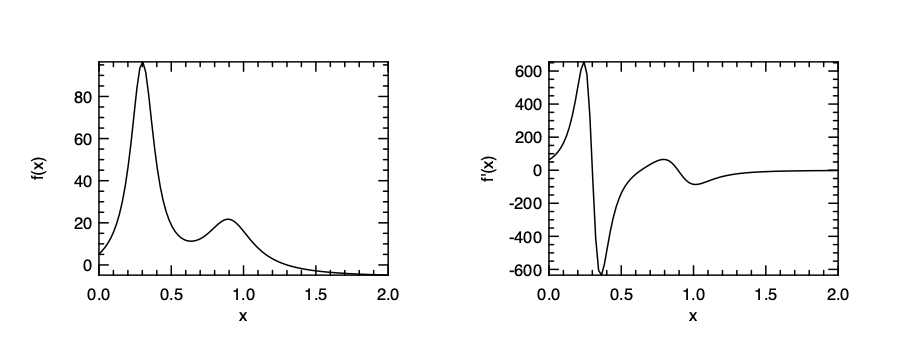
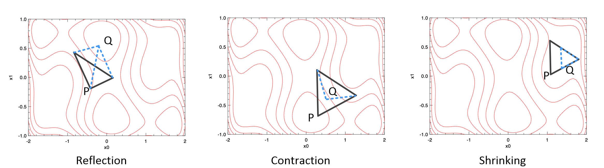
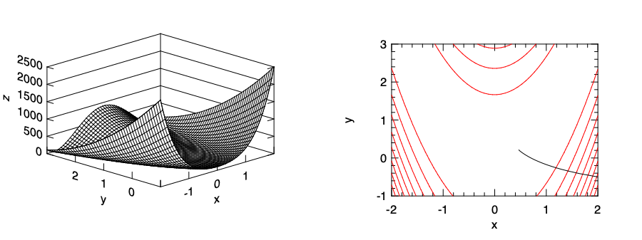

# Optimisation

Optimisation is one of the fundamental functionality in numerical computation.
In this chapter, we will briefly introduce the optimisation methods, and how Owl can be used to supports some of them.


## Introduction

Mathematical optimisation deals with the problem of finding minimums or maximums of a function. The solution can be numerical if closed-form expression does not exist. An optimisation problem has the form:

$$\textrm{minimise } f_0(\mathbf{x}),$$

$$\textrm{subject to } f_i(\mathbf{x}) \leq b_i, i = 1, 2, \ldots, m. $$ 

Here $$\mathbf{x}$$ is a vector that contains all the *optimisation variable*: $$\mathbf{x} = [x_0, x_1, ... x_n]$$. Function $$f_0 : \mathbf{R}^n \rightarrow \mathbf{R}$$ is the optimisation target, and is called an *objective function*, or *cost function*.
An optimisation problem could be bounded by zero or more *constraints*. $$f_i : \mathbf{R}^n \rightarrow \mathbf{R}$$ in a constraint is called a *constraint function*, which are bounded by the $$b_i$$'s.
The target is to find the optimal variable values $$\mathbf{x}^{*}$$ so that $$f_0$$ can take on a maximum or minimum value.

An optimisation problem formalises the idea "maximum benefit/minimise cost with given constraint", which is a widely applicable topic in many real world problems: scheduling computation/network resources, optimisation of investment portfolio, fitting math model based on observed data, logistics, aero engineering, competitive games...
Optimisation has already been applied in many areas.

An optimisation problem can be categorised into different types.
If for all the objective functions and constraint functions, we have:

$$ f_i(\alpha~x+\beta~y) = \alpha~f_i(x) + \beta~f_i(y),$$

the optimisation problem is then called *linear optimisation*. It is an important class of optimisation problems.
If we change the "$$=$$" to "$$\leq$$", it would make all the functions to be *convex*, and the problem then becomes *convex optimisation*, which can be seen as a generalised linear optimisation.
In the optimisation world, convexity is considered as the watershed between easy and difficult problems; because for most convex problems, there exist efficient algorithmic solutions.

Linear optimisation is important because non-negativity is a usual constraint on real world quantities, and that people are often interested in additive bounds. Besides, many problems can be approximated by a linear model.
Though still limited by actual problem size, the solution of most linear optimisation problems are already known and provided by off-the-shelf software tools.

Looking back, if we remove the constraints, it becomes an *unconstrained optimisation* problem.
If $$f$$ is convex and differentiable, this problem can be seen as finding the root of the derivative of $$f$$ so that $$f'(x^*) = 0$$.
As for the constrained version, one commonly used type is the *linear programming problem* where all the functions are linear. There are also other types of optimisations such as quadratic programming, semi-definite programming, etc.
One subset of constrained optimisation is the *equality constrained optimisation* where all the constraints are expressed in the form of equality $$Ax=b$$. This set of problem can be simplified into the corresponding unconstrained problems.

Optimisation covers a wide range of topics and we can only give a very brief introduction here.
In the rest of this chapter, we mostly cover the unconstrained and local optimisation.
We will cover the other more advanced content briefly in the end of this chapter.

This chapter uses differentiation techniques we have introduced in the previous chapter.
Compared to numerical differentiation, the algorithmic differentiation guarantees a true derivative value without loss of accuracy.
For the rest of this chapter, we prefer to use the algorithmic differentiation to compute derivatives when required, but of course you can also use the numerical differentiation.

## Root Finding

We have seen some examples of root finding in the Mathematical Functions chapter.
*Root finding* is the process which tries to find zeroes or *roots* of continuous functions.
It is not an optimisation problem, but these two topics are closely related.
It is beneficial for users to learn about the methods used in optimisation if they understand how the root finding algorithms work, e.g. how to find the root by bracketing and how to find target in an iterative manner.

The bisection method is a simple iterative method to find roots.
Let's use $$f(x) = x^2 = 2$$ as an example. We know that the root of this equation is $$x = \sqrt{2} = 1.4142135623\ldots$$.
To find this solution, the bisection methods works like this:
we know the solution must be between `1` and `2`, so first we set `x` to the middle point $$x=1.5$$;
since $$x^2 = 2.25$$ is larger than `2`, it means this `x` is too large;
so next we try $$x = 1\frac{1}{4}$$, which is too small; so next we try $$1\frac{3}{8}$$....
Bisect is slow to converge. It takes about 50 iterations to reach a precision of 14 digits after the decimal point.
However, it is a solid and reliable method to find roots, as long as the function is continuous in the given region.
Owl provides the `Owl_maths_root.bisec` function that implements this method.

Next is the Newton method.
It utilises the derivative of objective function $$f$$. It starts with a initial value $$x_0$$, and iterative update it following this process until converges:

$$x_{n+1} = x_{n} - \frac{f(x_n)}{f'(x_n)}.$$

We can use the Algorithm Differentiation module in Owl to perform the derivative calculation.
Again, let's find the root of $$x^2 - 2 = 0$$ using this method.
The Owl code here is just a plain translation.

```ocaml
open Algodiff.D

let f x = Maths.(x ** (F 2.) - (F 2.))

let _ =
	let x = ref 1. in
	for _ = 0 to 6 do
		let g = diff f (F !x) |> unpack_elt in
		let v = f (F !x) |> unpack_elt in
		x := !x -. v /. g;
		Printf.printf "%.15f\n" !x
	done
```

The resulting sequence is very short compared to the bisection method:

```
1.500000000000000
1.416666666666667
1.414215686274510
1.414213562374690
1.414213562373095
1.414213562373095
1.414213562373095
```

The Newton method is very efficient: it has quadratic convergence which means the square of the error at one iteration is proportional to the error at the next iteration.
It is the basis of many powerful numerical methods, such as optimisation, multiplicative inverses of numbers and power series, and solving transcendental equations, etc.

The Newton method requires the function to be smooth.
If $$f$$ is not smooth or computing derivative is not always available, we need to approximate the tangent at one point with a secant through two points. This is called a *Secant Method*:

$$ f'(x) \approx \frac{f(x_n) - f(x_{n-1})}{x_n - x_{n-1}}.$$

This method does not need to compute derivatives, and has similar convergence property as the Newton method.
In the Secant method, two points are used at each iteration in calculating derivatives.
As an improvement, the *Inverse Quadratic Interpolation* (IQI) method uses three points to do the interpolation.
The benefit of the method is that it's fast at the end of iterating, but unstable in during process.

These methods can be combined together as an even more powerful method: the *Brent's Method*.
It is generally considered the best of the root-finding routines.
It combines the robustness of Bisection methods, and the iteration speed of Secant and IQI methods.
The idea is to use the fast algorithm if possible, and turn to the slow but reliable method when in doubt.
This method is indeed what we implement in Owl for the `Owl_maths_root.brent` method. For example, the above example, can be simply solved with a one-liner.

```ocaml
# let f x = x *. x -. 2.
val f : float -> float = <fun>
# Owl_maths_root.brent f 0. 2.
- : float = 1.41421331999550248
```

## Univariate Function Optimisation

Now that we have briefly introduced how root-finding works and some classic methods, let's move on to the main topic of this chapter: unconstrained optimisation problems.
Let's start with the simple case that there is only one variable in the objective function.
We will introduce the optimisation methods for multivariate functions in the next section, and they all apply to the univariate case, but the specific algorithms can work faster. Besides, understanding the optimisation of univariate functions can be a good step before getting to know the multivariate ones.

### Use Derivatives

If a function is continuous and differentiable, then one obvious solution to find extreme values is to locate where the derivatives equals 0:

$$f'(x) = 0$$

This leads us back to our root finding solutions.
If you already know the analytical form of $$f'(x)$$, it's good. For example, if $$f(x) = x^2 - x$$, then you can directly find root for $$g(x) = 2x-1$$.
Otherwise, you can use the differentiation functions in owl.
Let's look at an example. The objective function is in a hump shape:

$$f(x) = \frac{1}{(x-0.3)^2 + 0.01} + \frac{1}{(x-0.9)^2 + 0.04} -6$$

```ocaml
open Algodiff.D

let f x = Maths.(
	(F 1.) / ((x - F 0.3) ** (F 2.) + F 0.01) +
	(F 1.) / ((x - F 0.9) ** (F 2.) + F 0.04) - F 6.)

let g = diff f

let f' x = f (F x) |> unpack_flt

let g' x = g (F x) |> unpack_flt
```

To better understand the optimisation along this function, we can visualise the image as below:

```ocaml

let _ =
  let h = Plot.create ~m:1 ~n:2 "plot_hump.png" in
  Plot.set_pen_size h 1.5;
  Plot.subplot h 0 0;
  Plot.plot_fun ~h f' 0. 2.;
  Plot.set_ylabel h "f(x)";
  Plot.subplot h 0 1;
  Plot.plot_fun ~h g' 0. 2.;
  Plot.set_ylabel h "f'(x)";
  Plot.output h
```



And then you can find the extreme values using the root finding algorithm, such as Brent's:

```ocaml
# Owl_maths_root.brent g' 0. 0.4
- : float = 0.30037562625819042
# Owl_maths_root.brent g' 0.4 0.7
- : float = 0.63700940626897
# Owl_maths_root.brent g' 0.7 1.0
- : float = 0.892716303287079405
```

It seems to work fine and find the extreme values correctly in the given range.
However, the problem of this method is that you cannot be certain which is maximum and which is minimum.

### Golden Section Search

Here we face the similar question again: what if computing derivatives of the function is difficult or not available?
That leads us to some search-based approach.
We have seen how we can keep reducing a pair of ranges to find the root of a function.
A close analogue in optimisation is also a search method called *Golden Section Search*.
It's an optimisation method that does not require calculating derivatives.
It is one choice to do optimisation if your function has a discontinuous first or second derivative.

The basic idea is simple. It also relies on keeping reducing a "range" until it is small enough.
The difference is that, instead of using only two numbers, this search method uses three numbers: `[a, b, c]`.
It contains two ranges: `[a,b]` and `[b, c]`.
For every iteration, we need to find a new number `d` within one of the two ranges.
For example, if we choose the `d` within `[b, c]`, and if $$f(b) > f(d)$$, then the new triplet becomes `[b, d, c]`, otherwise the new triplet is chosen as `[a, d, b]`.
With this approach, the range of this triplet keeps reducing until it is small enough and the minimum value can thus be found.

Then the only question is how to choose the suitable `d` point at each step.
This approach first chooses the larger of the two ranges, either `[a, b]` or `[b, c]`. And then instead of choosing the middle point in that range, it uses the fractional distance 0.38197 from the central point of the triplet.
The name comes from the Golden Ratio and length of range is also closely related with it.
This method is slow but robust. It guarantees that each new iteration will bracket the minimum to a range just 0.61803 times the size of the previous one.


## Multivariate Function Optimisation

The methods for univariate scenarios can be extended to solving multivariate optimisation problems.
The analogue of derivative in this multi-dimensional space is the *gradient*, which we have already seen in previous chapters.
To find the extreme values of a function with multiple independent values, you also have the same two options: to use gradients, or not.

### Nelder-Mead Simplex Method

First, similar to the Golden Section Search or Brent's, you can always opt for a non-gradient method, which is as slow as it is robust.
One such method we can use is the *Nelder-Mead Simplex Method*.
As its name suggests, it is probably the simplest way to minimise a fairly well-behaved multi-variate function.
It simply goes downhill in a straightforward way, without special assumptions about the objective function.

The basic idea of this method is to move a "simplex" gradually towards the lowest point on the function.
In a $$N$$-dimensional space (where the function contains $$N$$ variables), this simplex consists of $$N+1$$ points.
For example, for a function that has 2 variables, the simplex is a triangle; for 3 variables, a tetrahedron is used, etc.

From a starting point, the simplex move downwards step by step. At each step, the "highest" point $$p$$ that has the largest value on the function is found, then $$p$$ can be moved in three possible ways:

1. through the opposite face of the simplex to a new point; if this *reflected* point is now not the "worst" point (point that leads to largest values on the function) among the $$N+1$$ simplex points, accept it;
2. if the reflected point is the worst, then try to *contract* it towards the remaining points; if it is not the worst point, accept it;
3. if the contracted point is still the worst, then you have to *shrink* the simplex.

Repeat this process until it reaches a "valley", where the method "contracts itself in the transverse direction and tries to ooze down the valley".
This three different methods are illustrated here, where there are two variables and the simplex is a triangle.



There are some other method that does not rely on computing gradients such as Powell's method.
If the function is kind of smooth, this method can find the direction in going downhill, but instead of computing gradient, it relies on a one-dimensional optimisation method to do that, and therefore faster than the simplex method.
But this method is always a robust and cost-effective way to try solving an optimisation problem at the beginning.

### Gradient Descent Methods

A *descent method* is an iterative optimisation process.
The idea is to start from an initial value, and then find a certain *search direction* along a function to decrease the value by certain *step size* until it converges to a local minimum.
This process can be illustrated here.


Therefore, we can describe the $$n$$-th iteration of descent method as:

1. calculate a descent direction $$d$$;
2. choose a step size $$\alpha$$;
3. update the location: $$x_{n+1} = x_n + \alpha~d$$.

Repeat this process until a stopping condition is met, such as the update is smaller than a threshold.

Among the descent methods, the *Gradient Descent* method is one of the most widely used algorithms to perform optimisation and the most common way to optimise neural networks, which will be discussed in detail in the Neural Network chapter.
Based on the descent process above, Gradient Descent method uses the function gradient to decide its direction $$d$$.
The precess can be described as:

1. calculate a descent direction $$-\nabla~f(x_n)$$;
2. choose a step size $$\alpha$$;
3. update the location: $$x_{n+1} = x_n + \alpha~\nabla~f(x_n)$$.

Here $$\nabla$$ denotes the gradient.
The distance $$\alpha$$ along a certain direction is also called *learning rate*.
In a gradient descent process, when looking for the minimum, the point always follow the direction that is against the direction that is represented by the negative gradient.

We can easily implement this process with the algorithmic differentiation module in Owl.
Let's look at one example.
Here we use the [Rosenbrock function](https://en.wikipedia.org/wiki/Rosenbrock_function) which is usually used as a performance test for optimisation problems.
The function is defined as:

$$f(x, y) = (a - x)^2 + b(y-x^2)^2.$$ 

The parameters are usually set as $$a=1$$ and $$b=100$$.

```ocaml:gd
open Algodiff.D
module N = Dense.Ndarray.D

let rosenbrock a =
	let x = Mat.get a 0 0 in
	let y = Mat.get a 0 1 in
	Maths.( (F 100.) * (y - (x ** (F 2.))) ** (F 2.) + (F 1. - x) ** (F 2.) |> sum')
```

Now we hope to apply the gradient descent method and observe the optimisation trajectory.

```ocaml:gd
let a = N.of_array [|2.; -0.5|] [|1; 2|]
let traj = ref (N.copy a)
let a = ref a
let eta = 0.0001
let n = 200
```

As preparation, we use the initial starting point `[2, -0.5]`. The step size `eta` is set to `0.0001`, and the iteration number is 100.
Then we can perform the iterative descent process. You can also run this process in a recursive manner.

```ocaml:gd
let _ =
  for i = 1 to n - 1 do
	let u = grad rosenbrock (Arr !a) |> unpack_arr in
	a := N.(sub !a (scalar_mul eta u));
	traj := N.concatenate [|!traj; (N.copy !a)|]
  done
```

We apply the `grad` method on the Rosenbrock function iteratively, and the updated data `a` is stored in the `traj` array.
Finally, let's visualise the trajectory of the optimisation process.

```ocaml:gd
let plot () =
	let a, b = Dense.Matrix.D.meshgrid (-2.) 2. (-1.) 3. 50 50 in
	let c = N.(scalar_mul 100. (pow_scalar (sub b (pow_scalar a 2.)) 2.) + (pow_scalar (scalar_sub 1. a) 2.)) in

	let h = Plot.create ~m:1 ~n:2 "plot_gradients.png" in
	Plot.subplot h 0 0;
	Plot.(mesh ~h ~spec:[ NoMagColor ] a b c);

	Plot.subplot h 0 1;
	Plot.contour ~h a b c;

	let vx = N.get_slice [[]; [0]] !traj in
	let vy = N.get_slice [[]; [1]] !traj in
	Plot.plot ~h vx vy;
	Plot.output h
```

We first create a mesh grid based on the Rosenbrock function to visualise the 3D image, and then on the 2D contour image of the same function we plot how the result of the optimisation is updated, from the initial starting point towards a local minimum point.
The visualisation results are shown here.
On the right figure the black line shows the moving trajectory. You can see how it moves downwards along the slope in the right side figure.



Optimisation lays at the foundation of machine learning and neural network training.
In the `Owl.Optimise` module, we provide a `minimise_fun` function to perform this task.
This function is actually an internal function that aims mainly to serve the Neural Network module, but nevertheless we can still try to use this function to solve a optimisation problem with gradient descent method.

This function works based on the Algorithm Differentiation module.
It minimises function in the form of `f : x -> y` with regard to `x`. `x` is an AD ndarray, and `y` is an AD scalar value.
This function is implemented following the iterative descent approach.
Let's use the previous Rosenbrock function example to demonstrate how it works.

```ocaml:gd
let p = Owl_optimise.D.Params.default ()
let _ = p.epochs <- 10.
let _ = p.gradient <- Owl_optimise.D.Gradient.GD
```

First, we set the optimisation parameters. The `Owl_optimise.D.Params` module contains several categories of parameters, including the gradient method, learning rate, loss functions, regularisation method, momentum method, epoch and batch etc.
We will introduce these different parts in the Neural Network Chapter.
Currently, it suffices to just set the iteration number `epochs` to something like 10 or 20 iterations.
Then we set the gradient method to be the gradient descent.
Then we can just executing the code, starting from the same starting point:

```ocaml:gd
let init_value = N.of_array [|2.;-0.5|] [|1;2|] |> pack_arr
let _ = Owl_optimise.D.minimise_fun p rosenbrock init_value
```

This function output enhanced log result which in part looks like below. It shows how the function value, starting at the initial point, is quickly reduced to the bottom within only 10 steps using gradient descent.

```ocaml
...
2020-09-13 10:46:49.805 INFO : T: 00s | E: 1.0/10 | B: 1/10 | L: 2026.000000
2020-09-13 10:46:49.806 INFO : T: 00s | E: 2.0/10 | B: 2/10 | L: 476.101033
2020-09-13 10:46:49.807 INFO : T: 00s | E: 3.0/10 | B: 3/10 | L: 63.836145
2020-09-13 10:46:49.807 INFO : T: 00s | E: 4.0/10 | B: 4/10 | L: 37.776798
2020-09-13 10:46:49.808 INFO : T: 00s | E: 5.0/10 | B: 5/10 | L: 21.396863
2020-09-13 10:46:49.809 INFO : T: 00s | E: 6.0/10 | B: 6/10 | L: 11.742345
2020-09-13 10:46:49.809 INFO : T: 00s | E: 7.0/10 | B: 7/10 | L: 6.567733
2020-09-13 10:46:49.809 INFO : T: 00s | E: 8.0/10 | B: 8/10 | L: 4.085909
2020-09-13 10:46:49.810 INFO : T: 00s | E: 9.0/10 | B: 9/10 | L: 3.016714
2020-09-13 10:46:49.810 INFO : T: 00s | E: 10.0/10 | B: 10/10 | L: 2.594318
...
```

### Conjugate Gradient Method

One problem with the Gradient Descent is that it does not perform well on all functions.
For example, if the function forms a steep and narrow value, gradient descent takes many small steps to reach the minimum, bouncing back and forth, even if the function is in a perfect quadratic form.

The *Conjugate Gradient* method can solve this problem.
It was first proposed by Hestenes and Stiefel in their work "Methods of Conjugate Gradients for Solving Linear Systems" in 1952.
It is similar to the gradient descent, but at each step, the new direction does not totally follow the new gradient, but somehow *conjugated* to the old gradients and to all previous directions traversed.


For example, the figure above compares the different descent efficiency of the conjugate gradient with gradient descent.
Both methods start from the same position and go for the same direction.
At the next point, the gradient descent follows the direction of the descent, which is a blunt one since this function is steep.
But the conjugate method thinks, "hmm, this seems like a steep turn of direction, and I would prefer following the previous momentum a little bit".
As a result, the conjugate method follows a direction in between (the red dotted line), and it turns out that the new direction avoids all the bouncing and finds the minimum more efficiently than the gradient descent method.

In computation, instead of $$-\nabla~f(x_n)$$, conjugate gradient method chooses another way to calculate the descent direction.
It maintains two sequences of updates:

$$ x_{n+1} = x_{n} - \alpha_n~A~y_n $$

$$ y_{n+1} = x_{n+1} + \beta_n~y_n $$

where

$$\alpha_n = \frac{x_n^T~y_n}{y_n^T~A~y_n}$$

$$\beta_n = \frac{x_{n+1}^T~x_{n+1}}{x_n^T~x_n}.$$

Here $$x_n$$ is the function value to be minimised.
$$A$$ is a symmetric and positive-definite real matrix that denotes the system (describe in detail).
Similar to the gradient descent method, the conjugate gradient is supported in the Owl optimisation module as `Owl_optimise.D.Gradient.CG`.


### Newton and Quasi-Newton Methods

There is also a Newton Method in optimisation (it is not to be confused with the newton method used in root-finding). Still following the basic process of descent method, newton method starts from a initial point and then repeat the process:

1. compute the descent direction: $$d = -\frac{\nabla~f(x_n)}{\nabla^{2}~f(x_n)}$$
2. choose a step size $$\alpha$$;
3. update the location: $$x_{n+1} = x_n + \alpha~d$$.

Here $$\nabla^{2}~f(x_n)$$ denotes the second-order derivatives of function $$f$$.
For a scalar-valued function, its 2nd order derivatives can be represented by its Hessian matrix, which is introduced in the Algorithmic Differentiation chapter.
With the hessian matrix $$\mathbf{H}$$, the update process of newton method can be expressed as:

$$x_{n+1} = x_n - \alpha~\mathbf{H_n}^{-1}\nabla~f(x_n).$$

This can also be implemented in Owl with algorithmic differentiation.

```ocaml
open Owl
open Algodiff.D

let rec newton ?(eta=F 0.01) ?(eps=1e-6) f x =
  let g, h = (gradhessian f) x in
  if (Maths.l2norm' g |> unpack_flt) < eps then x
  else newton ~eta ~eps f Maths.(x - eta * g *@ (inv h))

let _ =
  let f x = Maths.(cos x |> sum') in
  let y = newton f (Mat.uniform 1 2) in
  Mat.print y
```

One nice property about the Newton's method is its rate of convergence: it converges quadratically.
However, one big problem with the newton method is the problem size.
In the real world applications, it is not rare to see optimisation problems with thousands, millions or more variants. In these cases, it is impractical to compute the Hessian matrix, not to mention its inverse.

Towards this end, the *Quasi-newton* methods are proposed.
The basic idea is to iteratively build up an approximation of the inverse of the Hessian matrix.
Their convergence is fast, but not as efficient as the Newton's method. It takes about $$n$$ quasi-newton iterations to progress similarly as the Newton's method.
The most important method in this category is BFGS (Broyden-Fletcher-Goldfarb-Shanno), named after its four authors.
In the BFGS algorithm, the search direction $$d_i$$ at each iteration $$i$$ is calculated by

$$ A_ip_i = -\nabla~f(x_i).$$

Here $$A_i$$ is the approximation of Hessian matrix which is of the same shape $$m\times~m$$. It is iteratively updated at each step.
As a practical enhancement to the algorithm, the Limited-BFGS (L-BFGS) address the memory usage issue in BFGS.
Instead of the large approximate matrix $$A_i$$, this method only stores a small number of vectors to represent this matrix, and also keeps updates from the last several iterations.

## Global Optimisation and Constrained Optimisation

This chapter mainly focuses on unconstrained optimisation, mostly to find local optima.
In the rest of this chapter we will give a very very brief introduction to global optimisation and constrained optimisation.

The basic idea of global optimisation is to provide effective search methods and heuristics to traverse the search space effectively.
One method is to start from a sufficient number of initial points and find the local optima, then choose the smallest/largest value from them.
Another heuristic is to try stepping away from a local optimal value by taking a finite amplitude step away from it, perform the optimisation method, and see if it leads to a better solution or still the same.

One example of algorithm: *Simulated Annealing Methods*. A suitable systems to apply Simulated Annealing consists of several elements.
First, it contains a finite set $$S$$, and a cost function $$f$$ that is defined on this set.
There is also a non-increasing function $$T$$ that projects the set of positive integers to real positive value.
$$T(t)$$ is called the *temperature* at time $$t$$.
Suppose at time $$t$$, the current state is $$i$$ in $$S$$.
It choose one of its neighbours $$j$$ randomly.
Next, if $$f(i) < f(j)$$ then $$j$$ is used as the next state. If not so, then $$j$$ is chosen as the next state with a probability of $$e^{-\frac{f(j)-f(i)}{T(t)}}$$, otherwise the next state stays to be $$i$$.
Starting from an initial state $$x_0$$, this process is repeated for a finite number of steps to find the optimum.

This method is inspired by thermodynamics, where metals cool and anneal starting from a high temperature. During this process, the atoms can often find the minimum energy state of the system automatically, just like finding the global optimum.
The simulated annealing has already been used to solve the famous NP-hard traveling salesman problem to find the shortest path.

The *Constrained Optimisation* is another large topic we haven't covered in this chapter.
Unlike all the optimisation problems we have seen so far, in a real-world problem it is hardly the case that you can free explore the optimum without any restriction, local or global.
More often than not, there are certain constraints on the variables.

For example, we can have an objective function: $$f(\mathbf{x}) = \mathbf{c}^Tx$$, where $$\mathbf{c}$$ is a parameter vector.
This function is subject to non-negativity condition: $$x_i \geq 0$$ and $$A\mathbf{x} \leq b$$, where $$b$$ and $$A$$ are known vector and matrix parameters.
Under such constraints, this optimisation problem is called Linear Programming (LP).
Sometimes the variables are only allowed to take integer values, then it is called Integer Linear Programming (ILP).
The linear programming is widely used to solve problems in various fields, such as portfolio optimisation in investment, manufacturing and transportation, route and traffic planning.
With the help of algorithms such as the simplex algorithm and interior point methods, LP problems can often be efficiently solved.

Compared to the linear optimisation, solving *non-linear optimisation* problems can still be very challenging, especially the non-convex and non-quadratic problems.
If the both objective function and the constrains are continuous, then the Lagrangian optimisation, with or without Karush-Kuhn-Tucker (KKT) condition, can be used; otherwise we can only rely on heuristics, such as the simulated annealing methods we have just mentioned.
The tools such as [LINDO](https://www.lindo.com) provide functionalities to solve various sorts of optimisation problems.

Finding a global solution that maximises or minimises the non-linear objective function is often time-consuming, even for only a small set of variables. Therefore, global optimisation of a non-linear problem is normally only used when it is absolutely necessary.
For example, if a system pressure test is modelled as an optimisation problem, given a small number of variants in the system, and a global extreme value has to find to test if the system is robust enough.
Otherwise, a local maximum or minimum is normally used instead as an approximation. In most engineering applications, a local extreme value is good enough.
Even though optimisation cannot promise a true extremism, and is easily affected by algorithm parameters and initial guess in iterative algorithms, as a trade-off, local optimisation is much faster and thus still widely used.

## Summary

In this chapter we give an overview of the mathematical optimisation field.
At first we introduce the categorisation of optimisation problem. It can be viewed in two dimensions: local or global, unconstrained or constrained.
This chapter mainly focuses on the local unconstrained problem.
Before this however, we introduce the techniques to find roots of function, since the basic idea of root finding is similar to that of optimisation: it can be solved with or without calculating derivatives.
The local unconstrained problem is further explained in two parts: the univariate and multivariate optimisation.
Of all the methods introduced here, the gradient descent is especially important, and we will see it again in the Regression and Neural Network chapters.
Finally, we give a brief peek at the topic of global and constrained  optimisation problems.

