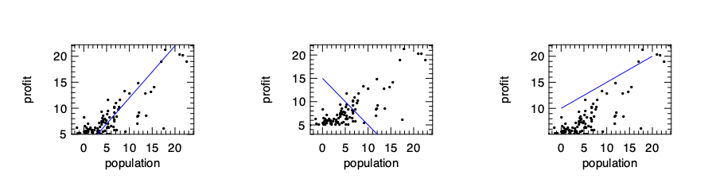
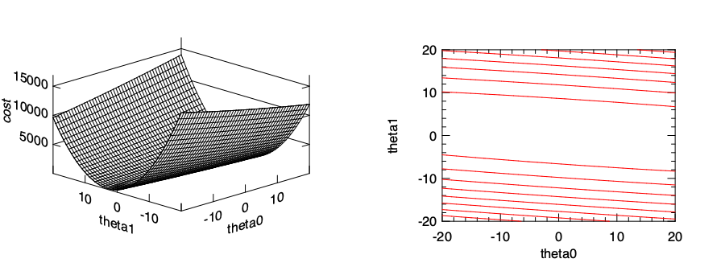
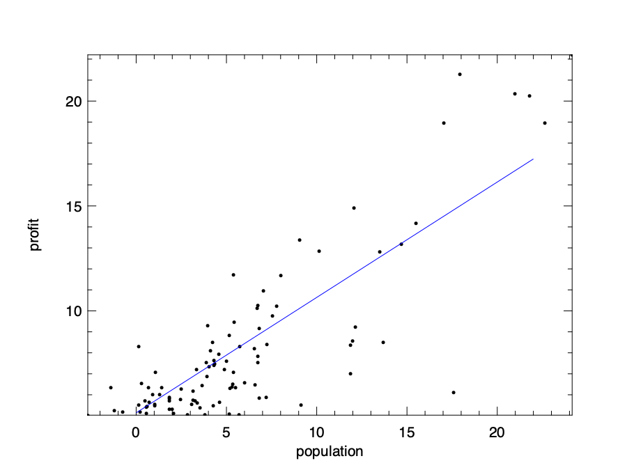
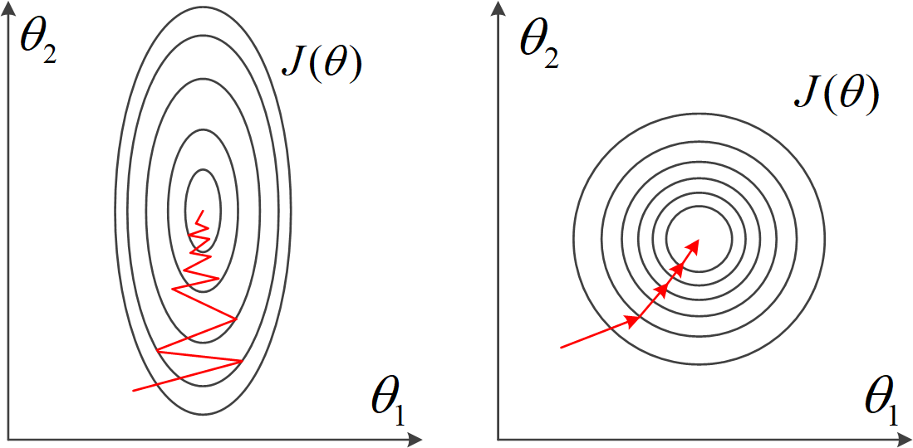
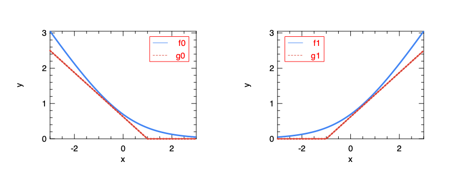
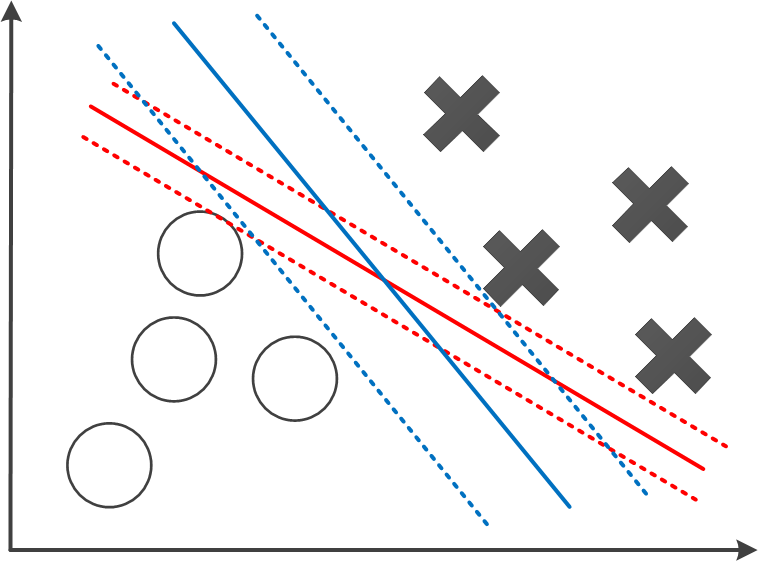
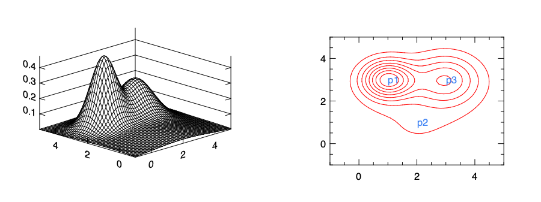

# Regression

Regression is an important topic in statistical modelling and machine learning.
It's about modelling problems which include one or more variables (also called "features" or "predictors") and making predictions of another variable ("output variable") based on previous data of predictors.
Regression analysis includes a wide range of models, from linear regression to isotonic regression, each with different theory background and application fields.
Explaining all these models are beyond the scope of this book.
In this chapter, we focus on several common forms of regressions, mainly linear regression and logistic regression. We introduce their basic ideas, how they are supported in Owl, and how to use them to solve real problems.

Part of the material used in this chapter is attributed to the Coursera course ML004: ["Machine Learning"](https://www.coursera.org/learn/machine-learning) by Andrew Ng.
This is a great introductory course if you are interested to learn machine learning.

## Linear Regression

Linear regression models the relationship of the features and output variable with a linear model.
It is the most widely used regression model in research and business and is the easiest to understand, so it makes an ideal starting point for us to build understanding or regression.
Let's start with a simple problem where only one feature needs to be considered.

### Problem: Where to locate a new McDonald's restaurant?

McDonald's is undoubtedly one of the most successful fast food chains in the world. By 2018, it has already opened more than 37,000 stores worldwide, and surely more is being built as you are reading this book.
One question you might be interested in then is: where to locate a new McDonald's branch?

According to its [website](https://www.mcdonalds.com/gb/en-gb/help/faq/18665-how-do-you-decide-where-to-open-a-new-restaurant.html#), a lot of factors are in play: area population, existing stores in the area, proximity to retail parks, shopping centres, etc.
Now let's simplify this problem by asserting that the potential profit is only related to area population.
Suppose you are the decision maker in McDonald's, and also have access to data of each branch store (profit, population around this branch), what would be your decision about where to locate your next branch?
Linear regression would be a good friend when you are deciding.

Part of the data is listed in [@tbl:regression:data01].
However, note that this data set (and most of the dataset used below) is not taken from real data source but taken from that of the ML004 course by Andrew Ng.
So perhaps you will be disappointed if you are looking for real data from running McDonald's.

| Profit | Population |
| :----: | :--------: |
| 20.27  | 21.76      |
| 5.49   | 4.26       |
| 6.32   | 5.18       |
| 5.56   | 3.08       |
| 18.94  | 22.63      |
| ...    | ...        |
: Sample of input data: single feature {#tbl:regression:data01}

Visualising these data can give a clear view about the relationship between profit and population.
We can use the code below to do that.
It first extracts the two columns data from the data file, converts it to dense matrix, and then visualise the data using the scatter plot.

```ocaml
let extract_data csv_file =
  let data = Owl_io.read_csv ~sep:',' csv_file in
  let data = Array.map (fun x -> Array.map float_of_string x) data
    |> Mat.of_arrays in
  let x = Mat.get_slice [[];[1]] data in
  let y = Mat.get_slice [[];[0]] data in
  x, y
```

```ocaml
let plot_data x y =
  let h = Plot.create "regdata.png" in
  Plot.scatter ~h ~spec:[ MarkerSize 6.] x y;
  Plot.set_xlabel h "population";
  Plot.set_ylabel h "profit";
  Plot.output h
```


The visualisation result is shown in [@fig:regression:regdata].
As can be expected, there is a clear trend that larger population and larger profit are co-related with each other. But precisely how?

### Cost Function

Let's start with a linear model that assumes the relationship between these two variables be formalised as:

$$ y = \theta_0~ + \theta_1~x_1 + \epsilon,$$ {#eq:regression:eq00}

where $y$ denotes the profit we want to predict, and input variable $x_1$ is the population number in this example.
Since modelling can hardly make a perfect match with the real data, we use $\epsilon$ to denote the error between our prediction and the data.
Specifically, we represent the prediction part as $h(\theta_0, \theta_1)$:
$$h_{\theta_0, \theta_1}(x_1) = \theta_0~ + \theta_1~x_1$$ {#eq:regression:eq01}

The $\theta_0$ and $\theta_1$ are the parameters of this model. Mathematically they decide a line on a plane.
We can now choose randomly these parameters and see how the result works, and some of these guesses are just bad intuitively, as shown in [@fig:regression:reg_options].
Our target is to choose suitable parameters so that the line is *close* to data we observed.



How do we define the line being "close" to the observed data then?
One frequently used method is to use the *ordinary least square* to minimise the sum of squared distances between the data and line.
We have shown the "$x$-$y$" pairs in the data above, and we represent the total number of data pairs with $n$, and thus the $i$'th pair of data can be represented with $x_i$ and $y_i$.
With these notations, we can represent a metric to represent the *closeness* as:

$$J_{\theta_0, \theta_1}(\boldsymbol{x}, \boldsymbol{y}) = \frac{1}{2n}\sum_{i=1}^{n}(h_{\theta_1, \theta_0}(x_i) - y_i)^2$$ {#eq:regression:eq02}

Here $\boldsymbol{x}$ and $\boldsymbol{y}$ are both vectors of length $n$.
In regression, we call this function the *cost function*. It measures how close the models are to an ideal one, and our target is thus clear: find suitable $\theta$ parameters to minimise the cost function.

Why do we use least square in the cost function? Physically, the cost function $J$ represents the average distance of each data point to the line.
By "distance" we mean the Euclidean distance between a data point and the point on the line with the same x-axis.
A reasonable solution can thus be achieved by minimising this average distance.

### Solving Problem with Gradient Descent

To give a clearer view, we can visualise the cost function with a contour graph.
According to [@eq:regression:eq02], the cost function  `j` is implemented as below:

```ocaml:gd
let j x_data y_data theta0 theta1 =
  let f x = x *. theta1 +. theta0 in
  Mat.(pow_scalar (map f x_data - y_data) 2. |> mean') *. 0.5
```

Here `x_data` and `y_data` are the two columns of data from [@tbl:regression:data01].
We can then visualise this cost function within a certain range using surface and contour graphs:

```ocaml:gd
let plot_surface x_data y_data =
  let x, y = Mat.meshgrid (-20.) 10. (-20.) 10. 100 100 in
  let z = Mat.(map2 (j x_data y_data) x y) in
  let h = Plot.create ~m:1 ~n:2 "reg_cost.png" in
  Plot.subplot h 0 0;
  Plot.(mesh ~h ~spec:[ NoMagColor ] x y z);
  Plot.set_xlabel h "theta0";
  Plot.set_ylabel h "theta1";
  Plot.set_zlabel h "cost";
  Plot.subplot h 0 1;
  Plot.contour ~h x y z;
  Plot.set_xlabel h "theta0";
  Plot.set_ylabel h "theta1";
  Plot.output h
```

In [@fig:regression:cost] we can see that cost function varies with parameters $\theta_0$ and $\theta_1$ with a bowl-like shape curve surface.
The minimum point lies at somewhere at the bottom of the "valley".
It is thus natural to recall the gradient descent we have introduced in the previous chapter, and use it to find the minimal point in this bowl-shape surface.



Recall from previous chapter that gradient descent works by starting at one point on the surface, and move in the *direction* of steepest descent at some *step size*, then gradually approach to a local minimum, hopefully as fast as possible.
Let's use a fixed step size $\alpha$, and the direction at certain point on the surface can be obtained by using partial derivative on the surface.
Therefore, what we need to do is to apply this update process iteratively for both $\theta$ parameters:
$$ \theta_j \leftarrow \theta_j - \alpha~\frac{\partial}{\partial \theta_j}~J_{\theta_0, \theta_1}(\boldsymbol{x}, \boldsymbol{y}), $$ {#eq:regression:eq03}
where $i$ is 1 or 2.

This process may seem terribly complex at first sight, but by solving the partial derivative we can calculate it as two parts:

$$ \theta_0 \leftarrow \theta_0 - \frac{\alpha}{n}\sum_{i=1}^{m} (h_{\theta_0, \theta_1}(x_i) - y_i)x_{i}^{(0)}, $$ {#eq:regression:eq04}
and
$$ \theta_1 \leftarrow \theta_1 - \frac{\alpha}{n}\sum_{i=1}^{m} (h_{\theta_0, \theta_1}(x_i) - y_i)x_{i}^{(1)}.$$ {#eq:regression:eq05}

Here the $x_{i}^{(0)}$ and $x_{i}^{(1)}$ are just different input features of the $i$-th row in data. Since currently we only focus on one feature in our problem, $x_i^{(0)} = 1$ and $x_i^{(1)} = x_i$.
Following these equations, you can manually perform the gradient descent process until it converges.

```ocaml
let gradient_desc x y =
  let alpha = 0.01 in
  let theta0 = ref 10. in
  let theta1 = ref 10. in

  for i = 0 to 500 do
    let f x = x *. !theta1 +. !theta0 in
    theta0 := !theta0 -. Mat.(map f x - y |> mean') *. alpha;
    theta1 := !theta1 -. Mat.((map f x - y) * x |> mean') *. alpha
  done;
  theta0, theta1
```

In the code above, we set the step size $\alpha = 0.01$, and start from a set of initial parameters: $\theta_0 = 10$ and $\theta_1 = 10$, and aim to improve them gradually.
We then iteratively update the parameters using 500 iterations.
Note that instead of manual summation in the equations, we use the vectorised operations with ndarray.
By executing the code, we can get a pair of parameters: $\theta_0 = 5.14$ and $\theta_1 = 0.55$.
To check if they indeed are suitable parameters, we can visualise them against the input data.
The resulting figure [@fig:regression:reg_gd] shows a line that aligns with input data quite nicely.



Of course, there is no need to use to manually solve a linear regression problem in Owl.
It has already provided high-level regression functions.
For example, the `ols` function in the `Regression` module uses the ordinary least square method we have introduced to perform linear regression.

```
val ols : ?i:bool -> arr -> arr -> arr array
```

Here the Boolean parameter `i` denotes if the constant parameter $\theta_0$ is used or not. By default it is set to `false`.
We can use this function to directly solve the problem, and the resulting parameters are similar to what we have get manually:

```
# let theta = Regression.D.ols ~i:true x y

val theta : Owl_algodiff_primal_ops.D.arr array =
  [|
         C0
R0 0.588442
;
        C0
R0 4.72381
|]
```

The API is not limited to the regression module. The `linreg` function in the Linear Algebra module can also be used to perform the same task.
The code snippet below first generates some random data, then using `linreg` function to perform a simple linear regression and plots the data as well as the regression line.

```ocaml 
let generate_data () =
  let x = Mat.uniform 500 1 in
  let p = Mat.uniform 1 1 in
  let y = Mat.(x *@ p + gaussian ~sigma:0.05 500 1) in
  x, y

let t1_sol () =
  let x, y = generate_data () in
  let h = Plot.create "plot_00.png" in
  let a, b = Linalg.D.linreg x y in
  let y' = Mat.(x *$ b +$ a) in
  Plot.scatter ~h x y;
  Plot.plot ~h ~spec:[ RGB (0,255,0) ] x y';
  Plot.output h
```

{ width=60% #fig:linear-algebra:plot_00}

Of course, since the process of finding suitable parameters can be performed using gradient descent methods, another approach to the regression problem is from the perspective of function optimisation instead of regression.
We can use the gradient descent optimisation methods introduced in the Optimisation chapter, and apply them directly on the cost function [@eq:regression:eq02].
As a matter of fact, the regression functions in Owl are mostly implemented using the `minimise_weight` function from the `Optimisation` module.

## Multiple Regression

Back to our McDonald's problem. We have seen how a new store's profit can be related to the population of its surrounding, and we can even predict it given previous data.
Now, remember that in the real world, population is not the only input features that affect the store's profit. Other factors such as existing stores in the area, proximity to retail parks, shopping centres, etc. also play a role.
In that case, how can we extend our one-variable linear regression to the case of multiple variables?

The answer is very straight forward. We just use more parameters, so the model becomes:

$$h_{\theta_0, \theta_1, \theta_2, \theta_3, \ldots})(x_1, x_2, x_3, \ldots) = \theta_0~ + \theta_1~x_1 + \theta_2~x_2 + \theta_3~x_3 \ldots $$ {#eq:regression:eq06}

However, to list all the parameters explicitly is not a good idea, especially when the question requires considering thousands or even more features.
Therefore, we use the vectorised format in the model:

$$h_{\boldsymbol{\theta}}(X^{(i)}) = \boldsymbol{\theta}~X^{(i)},$$ {#eq:regression:eq065}

where $\boldsymbol{\theta} = [\theta_0, \theta_1, \theta_2, \theta_3, ...]$, and $X^{(i)} = [1, x_1^{(i)}, x_2^{(i)}, x_3^{(i)}, ...]^T$ contains all the features from the $i$th row in data.

Accordingly, the cost function can be represented as:

$$ J_{(\boldsymbol{\theta}}(X, \boldsymbol{y}) = \frac{1}{2n}\sum_{i=1}^{n}(\theta~X^{(i)} - y^{(i)})^2,$$ {#eq:regression:eq07}

where $y^{(i)}$ is the output variable value on the $i$th row of input data.

The derivative and manual gradient descent are left as exercise.
Here we only show an example of using the regression function Owl has provided.
Similar to the previous problem, we provide some data to this multiple variable problem.
Part of the data is listed below:

| $x_1$ | $x_2$  | y |
| :--: | :--: | :--: |
| 1888 | 2 | 255000  |
| 1604 | 3 | 242900  |
| 1962 | 4 | 259900  |
| 3890 | 3 | 573900  |
| 1100 | 3 | 249900  |
| 1458 | 3 | 464500  |
| ...  | ... | ...   |
: Sample of input data: multiple features {#tbl:regression:data02}

The problem has two different features.
Similar to the single-variable regression problem in the previous section, by using the `ols` regression function in Owl, we can easily get the multi-variable linear model.
The data loading method is exactly the same as before.

```ocaml
let multi_regression csv_file =
  let data = Owl_io.read_csv ~sep:',' csv_file in
  let data = Array.map (fun x -> Array.map float_of_string x) data
    |> Mat.of_arrays in
  let x = Mat.get_slice [[];[0; 1]] data in
  let y = Mat.get_slice [[];[2]] data in
  Regression.D.ols ~i:true x y
```

The resulting parameters are shown below:

```ocaml
val theta : Owl_algodiff_primal_ops.D.arr array =
  [|
        C0
R0  57.342
R1 57.6741
;
        C0
R0 57.6766
|]
```

The result means that the linear model we get is about:

$$y = 57 + 57x_0 + 57x_1$$

Hmm, it might be right, but something about this model feels wrong. If you apply any line of data in [@tbl:regression:data02] to this model, the prediction result deviates too much from the true `y` value.
So what have gone wrong?
To address this problem, we move on to an important issue: normalisation.

### Feature Normalisation

Getting a result doesn't mean the end. Using the multi-variable regression problem as example, we would like to discuss an important issue about regression: *feature normalisation*.
Let's look at the multi-variable data again. Apparently, the first feature is magnitudes larger than the second feature.
That means the model and cost function are dominated by the first feature, and a minor change of this column will have a disproportionally large impact on the model.
That's why the model we get in the previous section is wrong.

To overcome this problem, we hope to pre-process the data before the regression, and normalise every features within about `[-1, 1]`.
This step is also called *feature scaling*.
There are many ways to do this, and one of them is the *mean normalisation*: for a column of features, calculate its mean, and divided by the difference between the largest value and smallest value, as shown in the code below:

```ocaml
let norm_ols data =
  let m = Arr.mean ~axis:0 data in
  let r = Arr.(sub (max ~axis:0 data) (min ~axis:0 data)) in
  let data' = Arr.((data - m) / r) in
  let x' = Mat.get_slice [[];[0; 1]] data' in
  let y' = Mat.get_slice [[];[2]] data' in
  let theta' = Regression.D.ols ~i:true x' y' in
  theta'
```

Here `data` is the matrix we get from loading the csv file from the previous section.
This time we get a new set of parameters for the normalised data:

```ocaml
val theta' : Owl_algodiff_primal_ops.D.arr array =
  [|
           C0
R0   0.952411
R1 -0.0659473
;
             C0
R0 -1.93878E-17
|]
```

These parameters set the model as: $\bar{y}=0.95\bar{x}_0-0.06\bar{x}_1$.
This result can be cross-validated with the analytical solution shown in the next section.
You can also manually check this result with the normalised data:

```ocaml
val data' : (float, Bigarray.float64_elt) Owl_dense_ndarray_generic.t =

            C0         C1         C2
 R0    0.68321   0.457447   0.678278
 R1  -0.202063 -0.0425532  -0.151911
 ...
```

Another benefit of performing data normalisation is to accelerate gradient descent. The illustration in [@fig:regression:normalisation] shows the point.
We have already seen that, in a "slim" slope, the Gradient Descent, which always trying to find the steepest downward path, may perform bad. Normalisation can reshape the slope to a more proper shape.



Normalisation is not only used in regression, but also may other data analysis and machine learning tasks.
For example, in computer vision tasks, an image is represented as an ndarray with three dimensions. Each element represents a pixel in the image, with a value between 0 and 255.
More often than not, this ndarray needs to be normalised in data pre-processed for the next step processing such as image classification.

### [Analytical Solution](#analytical-solution)

Before taking a look at some other forms of regression, let's discuss solution to the linear regression besides gradient descent.
It turns out that there is actually one close form solution to linear regression problems:

$$\boldsymbol{\theta} = (X^T~X)^{-1}X^Ty$$ {#eq:regression:eq075}

Chapter 3 of *The elements of statistical learning* [@friedman2001elements] covers how this solution is derived if you are interested.
Suppose the linear model contains $m$ features, and the input data contains $n$ rows, then here $X$ is a $n\times~(m+1)$ matrix representing the features data, and the output data $y$ is a $n\times~1$ matrix.
The reason there is $m+1$ columns in $X$ is that we need an extra constant feature for each data, and it equals to one for each data point.

With this method, we don't need to iterate the solutions again and again until converge. We can just compute the result with one pass with the given input data.
This calculation can be efficiently performed in Owl using its Linear Algebra module.
Let's use the dataset from multi-variable regression again and perform the computation.

```
let o = Arr.ones [|(Arr.shape x).(0); 1|]
let z = Arr.concatenate ~axis:1 [|o; x'|];;

let solution = Mat.dot (Mat.dot
    (Linalg.D.inv Mat.(dot (transpose z) z)) (Mat.transpose z)) y'
```

Here the `x'`, `y'` are the normalised data from the previous section.
The result is close to what we have gotten using the gradient descent method:

```ocaml
val solution : Mat.mat =

             C0
R0 -3.28614E-17
R1     0.952411
R2   -0.0659473
```

Compared to gradient descent, this method does not require multiple iterations, and you also don't need to worry about hyper-parameters settings such as the choice of learning rate.
On the other hand, however, this approach has its own problems.
When the size of $X$, or the input data, becomes very large, the computation of large linear algebra operations such as matrix multiplication and inversion could become really slow.
Or even worse: your computer might don't even have enough memory to perform the computation.
Compare to it, gradient descent proves to work well even when the dataset is large.

Besides, there could be no solution at all using this method. That's when the $X^T~X$ matrix is non-invertible, e.g. a singular matrix.
That could be caused by multiple reasons. Perhaps some of the features are linear dependent, or that there are many redundant features.
Then techniques such as choosing feature or regularisation are required.
Most importantly, there is not always a close-form solution for you to use in other regression or machine learning problems. Gradient descent is a much more general solution.

## Non-linear regressions

As powerful as it is, not all the regression problems can be solved with the linear model above.
A lot of data can follow other patterns than a linear one.
We can show this point with data from the [Boston Housing Dataset](https://www.cs.toronto.edu/~delve/data/boston/bostonDetail.html).
This dataset contains information collected by the U.S Census Service concerning housing in the area of Boston Mass.
It contains 506 cases.
Each case contains 14 properties, such as crime rate, nitric oxides concentration, average number of rooms per dwelling, etc.
For this example, we observe the relationship between percentage of lower status of the population ("LSTAT") and  the median value of owner-occupied homes in $1000's ("MDEV").

```ocaml
let f ?(csv_file="boston.csv") () =
  let data = Owl_io.read_csv ~sep:' ' csv_file in
  let data = Array.map (fun x -> Array.map float_of_string x) data
    |> Mat.of_arrays in
  let lstat = Mat.get_slice [[];[12]] data in
  let medv = Mat.get_slice [[];[13]] data in
  lstat, medv
```


We can then visualise the data to see the trend clearly.
As [@fig:regression:boston] shows, the relationship basically follows a convex curve.
You can try to fit a line into these data, but it's quite likely that the result would not be very fitting.
And that requires us to use non-linear models.
In this section, we present a type of non-linear regression, the *polynomial regression*.
We show how to use them with examples, without going into details of the math.

In polynomial regression, the relationship between the feature $x$ and the output variable is modelled as an $n$-th degree polynomial in the feature $x$:

$$ h_{\boldsymbol{\theta}}(x) = \theta_0 + \theta_1~x + \theta_2~x^2 + \theta_3~x^3 \ldots $$ {#eq:regression:eq08}

Owl provides a function to perform this forms of regression:

```
val poly : arr -> arr -> int -> arr
```

In the code, we use the `poly` function in the `Regression` module to get the model parameter. We limit the model to be 2nd order.

```ocaml
let poly lstat medv =
  let a = Regression.D.poly lstat medv 2 in
  let a0 = Mat.get a 0 0 in
  let a1 = Mat.get a 1 0 in
  let a2 = Mat.get a 2 0 in
  fun x -> a0 +. a1 *. x +. a2 *. x *. x
```

By executing the `poly` function, the parameters we can get are:

```
- : Owl_algodiff_primal_ops.D.arr =

          C0
R0    42.862
R1  -2.33282
R2 0.0435469
```

That gives us the polynomial model:

$$f(x) = 42.8 - 2.3x + 0.04x^2 + \epsilon$$

We can visualise this model to see how well it fits the data:


## [Regularisation](#regularisation)

Regularisation is an important issue in regression, and is widely used in various regression models.
The motivation of using regularisation comes from the problem of *over-fitting* in regression.
In statistics, over-fitting means a model is tuned too closely to a particular set of data and it may fail to predict future observations reliably.

Let' use the polynomial regression as an example.
Instead of using an order of 2, now we use an order of 4.
Note that we take only a subset of 50 of the full data set to better visualise the over-fitting problem:


```
let subdata, _ = Mat.draw_rows ~replacement:false data 50
```

we can get the new model:

$$f(x) = 63 - 10.4x + 0.9x^2 -0.03x^3 + 0.0004x^4.$$


This model could be visualised as in [@fig:regression:poly4s].
Apparently, this model fits too closely with the given data, even the outliers. Therefore, this model does not make a good prediction for future output values.

To reduce the effect of higher order parameters, we can penalise these parameters in the cost function. We design the cost function so that the large parameter values leads to higher cost, and therefore by minimising the cost function we keep the parameters relatively small.
Actually we don't need to change the cost functions dramatically. All we need is to add some extra bit at the end.
For example, we can add this:

$$J_{\boldsymbol{\theta}}(\boldsymbol{x}, \boldsymbol{y})=\frac{1}{2n}\left[ \sum_{i=1}{n}(h_{\theta}(x^{(i)} - y^{(i)}))^2 + \lambda\sum_{j=1}^{m}\theta_j^2 \right].$$ {#eq:regression:eq10}

Here the sum of squared parameter values is the penalty we add to the original cost function, and $\lambda$ is a regularisation control parameter.
That leads to a bit of change in the derivative of $J(\theta)$ in using gradient descent:

$$\theta_j \leftarrow \theta_j - \frac{\alpha}{n} \left[ \sum_{i=1}^{m} (h_{\Theta}(x_i) - y_i)x_{i}^{(j)} - \lambda~\theta_j \right].$$ {#eq:regression:eq11}

We can now apply the new update procedure in gradient descent code, with a polynomial model with 4th order.

Currently not all the regression methods in Owl support regularisation. But we can implement one easily.
For the polynomial regression, we can implement it this way:

```ocaml
open Optimise.D
open Optimise.D.Algodiff

let poly_ridge ~alpha x y n =
  let z =
    Array.init (n + 1) (fun i -> A.(pow_scalar x (float_of_int i |> float_to_elt)))
  in
  let x = A.concatenate ~axis:1 z in
  let params =
    Params.config
      ~batch:Batch.Full
      ~learning_rate:(Learning_Rate.Const 1.)
      ~gradient:Gradient.Newton
      ~loss:Loss.Quadratic
      ~regularisation:(Regularisation.L2norm alpha)
      ~verbosity:false
      ~stopping:(Stopping.Const 1e-16)
      100.
  in
  (Regression.D._linear_reg false params x y).(0)
```

The implementation is based on the optimisation module and the general low level `_linear_reg` function.
It utilises the optimisation parameter module, which will be explained in detail in the Neural Network chapter.
For now, just know that the key point is to use the L2-norm function as regularisation method.
By using this regularised version of polynomial regression, we can have an updated model as shown in [@fig:regression:poly4s_reg].


Here we choose the alpha parameter to be 20.
We can see that by using regularisation the model is less prone to the over-fitting problem, compared to [@fig:regression:poly4s].
Note that linear regression is used as an example in the equation, but regularisation is widely use in all kinds of regressions.

### Ols, Ridge, Lasso, and Elastic_net

You might notice that Owl provides a series of functions other than `ols` in the regression module:

```
val ridge : ?i:bool -> ?alpha:float -> arr -> arr -> arr array

val lasso : ?i:bool -> ?alpha:float -> arr -> arr -> arr array

val elastic_net : ?i:bool -> ?alpha:float -> ?l1_ratio:float -> arr -> arr -> arr array
```

What are these functions? The short answer is that: they are for regularisation in regression using different methods.
The `ridge` cost function adds the L2 norm of $\theta$ as the penalty term: $\lambda\sum\theta^2$, which is what we have introduced.
The `lasso` cost function is similar. It adds the *L1 norm*, or absolute value of the parameter as penalty: $\lambda\sum|\theta|$.
This difference makes `lasso` allow for some coefficients to be zero, which is very useful for feature selection.
The `elastic_net` is proposed by Hui Zou and Trevor Hastie of the Stanford University to combine the penalties of the previous two. What it adds is this:
$$\lambda(\frac{1-a}{2}\sum\theta^2 + a\sum|\theta|),$$ {#eq:regression:eq115}
where $a$ is a control parameter between `ridge` and `lasso`.
The elastic net method aims to make the feature selection less dependent on input data.
We can thus choose one of these functions to perform regression with regularisation on the dataset in the previous chapter.

## Logistic Regression

So far we have been predicting a value for our problems, whether using linear, polynomial or exponential regression.
What if we care about is not the value, but a classification? For example, we have some historical medical data, and want to decide if a tumour is cancer or not based on several features. These kind of variables are called *categorical variables*. They represent data that can be divided into groups.
Such variables include "race", "age group", "religion", etc.
To predicting if a given data belongs to which group for a categorical variable, the previous regression methods do not apply. Instead, we need to use the *Logistic Regression*.
Its point is to figure out certain "boundaries" among the data space so that different data can be divided into corresponding variable group.
Let's start with introducing how it works.

### Sigmoid Function

As a naive solution, we can still try to continue using linear regression, and the model can be interpreted as the possibility of one of these results.
But one problem is that, the prediction value could well be out of the bounds of [0, 1]. Then maybe we need some way to normalise the result to this range?
The solution is to use the sigmoid function (or logistic function): $\sigma~(x) = \frac{1}{1 + e^{-x}}$.


As shown in [@fig:regression:sigmoid], this function projects value within the range of [0, 1].
Applying this function on the returned value of a regression, we can get a model that returns value within [0, 1].

$$h_{\boldsymbol{\theta}}(\boldsymbol{x}) = \sigma(\boldsymbol{\theta}^T~\boldsymbol{x}) = \frac{1}{1 + e^{-\boldsymbol{\theta}^T~\boldsymbol{x}}}.$$ {#eq:regression:eq12}

Now we can interpret this model easily. The function value can be seen as possibility. If it is larger than 0.5, then the classification result is 0, otherwise it returns 1.
Remember that in logistic regression we only care about the classification. So for a 2-class classification, returning 0 and 1 is enough.

### Cost Function

With the new model comes new cost function.
Recalls that we can find suitable parameters by minimising the cost function with training data.
The cost function of linear regression in [@eq:regression:eq02] indicates the sum of squared distances between the data and the model line.
We can continue to use it here, with the new $h(x)$ function defined as sigmoid function.
But the problem is that, in this case it will end up being a non-convex function, and the gradient descent can only give us one of many local minimums.

Therefore, in the logistic regression, we define its cost function as:

$$J_{\boldsymbol{\theta}}(\boldsymbol{x}, \boldsymbol{y}) = \frac{1}{m}\sum_{i=1}^{m}g(h(x^{(i)})-y^{(i)}),$$ {#eq:regression:logistic_cost}

where the function $g$ is defined as:

$$g(h_{\boldsymbol{\theta}}(x), y) = -log(h_{\boldsymbol{\theta}}(x)), \textrm{if }~y = 1, $$ {#eq:regression:eq13} or
$$g(h_{\boldsymbol{\theta}}(x), y) = -log(1 - h_{\boldsymbol{\theta}}(x)), \textrm{if }~y = 0.$$ {#eq:regression:eq14}

Both forms of function $g()$ capture the same idea.
Since the $h$ function is in the range [0, 1], the range of $g$ is [0, $\infty$].
When the value of $h(x)$ and $y$ are close, then the item within the summation in [@eq:regression:logistic_cost] $g(h(x)) - y$ will be close to 0;
on the other hand, if the prediction result $h(x)$ and $y$ are different, then $g(h(x)) - y$ will incur a large value to the cost function as penalty.

The previous three equations can be combined as one:

$$J_{\boldsymbol{\theta}}(\boldsymbol{x}, \boldsymbol{y}) = \frac{1}{m}\sum_{i=1}^{m}(y^{(i)}\log(h(x^{(i)})) + (1-y^{(i)})\log(1-h(x^{(i)})))$$ {#eq:regression:logistic_cost_large}

The next step is to follow [@eq:regression:eq03] to find the partial derivative of this cost function and then iteratively minimise it to find suitable parameters $\Theta$.
It turns out that the partial derivative of this cost function is similar as that in linear regression:

$$\frac{\partial J_{\boldsymbol{\theta}}(\boldsymbol{x}, \boldsymbol{y})}{\partial \theta_j} = \frac{1}{m}\sum_{i=1}^{m}(\sigma_{\boldsymbol{\theta}}(x^{(i)}) - y^{(i)})^2~x_j^{(i)}$$ {#eq:regression:eq15}

This solution benefits from the fact that the sigmoid function has a simple derivative: $\sigma^{'}~(x) = \sigma(x)~(1 - \sigma(x))$.

With this derivative at hand, the rest is similar to what we have done with linear regression: follow [@eq:regression:eq03] and repeat this gradient descent step until it converges.
Owl also provides a `logistic` function in the `Regression` module.
In the next section, we will show an example of binary categorisation with logistic regression.

### Example

To perform the logistic regression, let's first prepare some data. We can generate the data with the code below:

```ocaml:logistic
let generate_data () =
  let open Mat in
  let c = 500 in
  let x1 = (gaussian c 2 *$ 2.) in
  let a, b = float_of_int (Random.int 5), float_of_int (Random.int 5) in
  let x1 = map_at_col (fun x -> x +. a) x1 0 in
  let x1 = map_at_col (fun x -> x +. b) x1 1 in
  let x2 = (gaussian c 2 *$ 1.) in
  let a, b = float_of_int (Random.int 5), float_of_int (Random.int 5) in
  let x2 = map_at_col (fun x -> x -. a) x2 0 in
  let x2 = map_at_col (fun x -> x -. b) x2 1 in
  let y1 = create c 1 ( 1.) in
  let y2 = create c 1 ( 0.)in
  let x = concat_vertical x1 x2 in
  let y = concat_vertical y1 y2 in
  x, y

let x, y = generate_data ()
```

Basically this code creates two groups of random data with `gaussian` function.
Data `x` is of shape `[|1000; 2|]`, and is equally divided into two groups.
The first group is at a higher position, and the corresponding `y` label is positive. The nodes in lower group are labelled as negative.
Our task is to try to divide a given data point into one of these two categories.

With the `logistic` function, we train a model:

$$h_{\boldsymbol{\theta}}(x_0, x_1) = \sigma(\theta_0~x_0 + \theta_1~x_1 + \theta_2).$$

In the linear model within the sigmoid function, we have two parameters $\theta_0$ and $\theta_1$ for the two variables that represent the two coordinates of a data point.
The `logistic` functions takes an `i` argument. If `i` is set to `true`, the linear model contains an extra parameter $\theta_2$.
Based on the data, we can get the parameters by simply executing:

```ocaml:logistic
# let theta =
    Owl.Regression.D.logistic ~i:true x y;;
val theta : Algodiff.D.A.arr array =
  [|
        C0
R0 16.4331
R1 12.4031
;
        C0
R0 20.7909
|]
```

Therefore, the model we get is:

$$h(x_0, x_1) = \sigma~(16~x_0 + 12~x_1 + 20).$$ {#eq:regression:logistic_result}

We can validate this model by comparing the inference result with the true label `y`.
Here any prediction value larger than 0.5 produced by the model is deemed as positive, otherwise it's negative.

```ocaml:logistic
let test_log x y =
  let p' = Owl.Regression.D.logistic ~i:true x y in
  let p = Mat.(p'.(0) @= p'.(1)) in
  let x = Mat.(concat_horizontal x (ones (row_num x) 1)) in
  let y' = Mat.(sigmoid (x *@ p)) in
  let y' = Mat.map (fun x -> if x > 0.5 then 1. else 0.) y' in
  let e = Mat.((mean' (abs (y - y')))) in
  Printf.printf "accuracy: %.4f\n" (1. -. e)
```
```ocaml:logistic
# test_log x y;;
accuracy: 0.9910
- : unit = ()
```

The result shows that, the trained model has more than 99% prediction accuracy when applied on the original dataset. Of course, a more suitable approach would be to use a new set of test data set, but you can get a basic idea about how well it works.

**Decision Boundary**

As we have said, the physical meaning of classification is to draw a *decision boundary* in a hyperplane to divide different groups of data points.
For example, if we are using a linear model $h$ within the sigmoid function, the linear model itself divides the points into two halves in the plane.
Use [@eq:regression:logistic_result] as an example, any $x_0$, $x_1$ that makes the $h(x_0, x_1) > 0$ is taken as positive, otherwise it's negative.
Therefore, the boundary line we need to draw is: $16~x_0 + 12~x_1 + 20 = 0$, or  $x_1 = -(4x_0 + 5)/3$.
We can visualise this decision boundary on a 2D-plane and how it divides the two groups of data.

```ocaml:logistic
open Owl
let data = Mat.concat_horizontal x y

let f x = -.(4. *. x +. 5.) /. 3.

let plot_logistic data =
  let neg_idx = Mat.filter_rows (fun m -> Mat.get m 0 2 = 0.) data in
  let neg_data = Mat.get_fancy [ L (Array.to_list neg_idx); R [] ] data in
  let pos_idx = Mat.filter_rows (fun m -> Mat.get m 0 2 = 1.) data in
  let pos_data = Mat.get_fancy [ L (Array.to_list pos_idx); R [] ] data in
  (* plot dataset *)
  let h = Plot.create "reg_logistic.png" in
  Plot.(scatter ~h ~spec:[ Marker "#[0x2217]"; MarkerSize 5. ]
      (Mat.get_slice [[];[0]] neg_data)
      (Mat.get_slice [[];[1]] neg_data));
  Plot.(scatter ~h ~spec:[ Marker "#[0x2295]"; MarkerSize 5. ]
      (Mat.get_slice [[];[0]] pos_data)
      (Mat.get_slice [[];[1]] pos_data));
  (* plot line *)
  Plot.plot_fun ~h ~spec:[ RGB (0,0,255); LineWidth 2. ] f (-5.) 5.;
  Plot.output h
```

The code above visualises the data, two types of points showing the negative and positive data, and the line shows the decision boundary we get from the logistic model.
The result is shown in [@fig:regression:logistic].
There are some wrong categorisations, but you can see that this model works well for most the data points.


Of course, we can use more than linear model within the sigmoid function.
for example, we can use to set the model as $h_{\boldsymbol{\theta}}(x) = \sigma(\theta_0 + \theta_1~x + \theta_2~x^2)$.
If we use a non-linear polynomial model, the plane is divided by curve lines.

Logistic regression uses the linear model.
If you believe your data won't be linearly separable, or you need to be more robust to outliers, you should look at SVM (see sections below) and look at one of the non-linear models.

### Multi-class classification

We have seen how to classify objects into one of two classes using logistic regression.
What if our target consists of multiple classes?
For this problem, one approach is called *one-vs-all*.
Its basic idea is simple.
Suppose we need to classify one object into three different classes; we can still use the logistic regression, but instead of one classifier, we train three binary classifiers, each one is about one class against the other two.
In the prediction phase, using an object as input, each classifier yields a probability as output.
We then choose the largest probability as the classification result.

The multi-class classification problem is prevalent in the image recognition tasks, which often includes classifying one object in the image into of ten, hundred, or more different classes.
For example, one popular classification problem is the hand-written recognition task based on the [MNIST](http://yann.lecun.com/exdb/mnist/) dataset.
It requires the model to recognise a 28x28 grey scale image, representing a hand-written number, to be one of ten numbers, from 0 to 9.
It is a widely used ABC task for Neural Networks.
We will discuss this example in detail later in the beginning of the Neural Network chapter.
You will see how this logistic regression line of thought is extended, and how the real-world multi-class classification problems are solved using neural networks.

## Support Vector Machine

The *Support Vector Machines* (SVMs) are a group of supervised learning algorithms that can be used for classification and regression tasks.
The SVM is one of the most powerful and widely used Machine Learning methods in both academia and industry. It is used in solve real-world problems in various fields, including the classification of text, image, satellite data, protein data, etc.

Similar to logistic regression, the SVM creates a hyperplane (decision boundary) that separates data into classes.
However, it tries to maximise the "margin" between the hyperplane and the boundary points of both classes in the data.
By use the "kernels", the SVM can also fit non-linear boundaries.
Besides, the SVM works well with unstructured and semi-structured data such as text and images, with less risk of over-fitting.
In this section, we will introduce the basic idea behind SVM and how it works in example.

Again, let's start with the objective cost function. It turns out that the cost function of the SVM is very similar to that of logistic regression in [@eq:regression:logistic_cost_large], with some modifications:

$$J_{\boldsymbol{\theta}}(\boldsymbol{x}, \boldsymbol{y}) = \frac{1}{m}\sum_{i=1}^{m}(y^{(i)}g_0(\boldsymbol{\theta}^T~x^{(i)}) + (1-y^{(i)})g_1(\boldsymbol{\theta}^T~x^{(i)})) + \frac{1}{2}\sum_{j=1}^m\theta_j^2$$ {#eq:regression:svm_cost}

Function $g_0()$ and $g_1()$ are simplification of the logarithm function:



Here $f_0(x) = -\log(\sigma(x))$ is what is used in the cost function of the logistic regression. This computation-heavy logarithm is replaced with $g_0(x)$, a simple segmented function.
Similarly, $f_1(x) = -\log(1-\sigma(x))$ is replaced by $g_1(x)$.

Also, another difference is that a regularisation item is added to the cost function in [@eq:regression:svm_cost].
Therefore, considering the properties of $g_0(x)$ and $g_1(x)$, by minimising this function, we are actually seeking parameters set $\boldsymbol{\theta}$ to minimise $\sum_{j=1}^{m}\theta_j^2$, with the limitation that $\boldsymbol{\theta}^Tx > 1$ when $y=1$, or $\boldsymbol{\theta}^Tx < -1$ when $y=0$.



It turns out that, by solving this optimisation problem, SVM tends to get a *large margin* between different categories of data points.
One example is shown in [@fig:regression:svm_margin].
It shows two possible decision boundaries, both can effectively divide the two groups of training data.
But the blue boundary has a larger distance towards the positive and negative training samples, denoted with dotted lines. These dotted lines indicates the *margin* of the SVM.
As to the inference phase, any data $x$ that makes $\boldsymbol{\theta}^T~x > 0$ is deemed positive, i.e. $y=1$, or negative if $\boldsymbol{\theta}^T~x < 0$.
It is intuitive to see that a model with larger margin tends to predict the test data better.

### Kernel and Non-linear Boundary

So far we have talked about the linear boundary, but that's surely not the limit of SVM.
In fact, it is normally the case that we use SVM to train a non-linear boundary in categorising different groups of points in the space.
To do that, we can simply update the linear part $\theta^Tx$ in the cost function to make it a non-linear function, e.g.:

$$f_{\boldsymbol{\theta}}(\boldsymbol{x}) = \theta_0 + \theta_1x_1 + \theta_2x_2 + \theta_3x_1x_2 + \theta_4x_1^2 + \theta_5x_2^2 + \ldots$$ {#eq:regression:svm_kernel_1}

This function and the linear function  $\theta^Tx$ are both examples of a *Kernel Function*, which are to be used within $g()$ in the cost function.
With the trained parameters $\theta$, if [@eq:regression:svm_kernel_1] is larger than zero, then the inference result is positive, otherwise it's negative.
However, this model is apparently not scalable with regard to the number of features of the input.

Currently, one common way to model this function is to choose $k$ reference points in the space, and use the *distances* to these points as feature.
In other words, for data $\boldsymbol{x}$ that contains any number of features, the objective function is reduced to use a fixed $k$ features:

$$\theta_0 + \sum_{i=1}^k\theta_i~d_i,$$ {#eq:regression:svm_kernel_2}

where $d_i$ is the "distance" of the current point to the reference point $p_k$.
In inference phase, if this function is larger than zero, then the point is predicted to be positive, otherwise it is negative.

So how exactly is this "distance" calculated? There are many ways to do that, and one of the most used is the gaussian distance, as shown in [@eq:regression:svm_kernel_3].
Here the total number of feature is $n$. $x_j$ is the $j$-th feature of $x$ and $p_k^{(j)}$ is the $j$-th feature of reference point $p_k$.

$$d_i = \exp(-\frac{\sum_{j=1}^n(x_j - p_k^{(j)})}{2\sigma^2}).$$ {#eq:regression:svm_kernel_3}

The intuition is that, with suitable trained parameters $\theta$, this approach can represent different regions in the classification.
For example, in [@fig:regression:svm_kernel] we choose only three reference points: $p_0$, $p_1$, and $p_2$.
In this example, we set the parameters for $p_1$ and $p_3$ to be larger than that of $p_2$.
The figure left shows the summation of distances of a point to all three of them.
The contour graph on the right then shows clearly how this model lead to a prediction that's obviously large around a region that's close to the point $p_1$ and $p_3$.
That's the boundary we use to decide if a point is positive (close to $p_1$ or $p_3$) or negative.
You can imagine how this non-linear boundary can be changed with new parameters.



Only three reference points is normally not enough to support a complex non-linear boundary.
In fact, one common practice is to use all the training data, each as one point, as the reference points.

In this example, the distance function $d_i$ is called the *Kernel Function*.
The Gaussian kernel we have just used is a commonly used one, but other kernel functions can also be used in [@eq:regression:svm_kernel_2], such as the polynomial kernel, the Laplacian kernel, etc.
The previous linear model $\theta^T~x$ is called the linear kernel, or "no kernel" as is sometimes called.

### Example

The SVM is a very important and widely used machine learning method, and that is accompanied by highly efficient implementation in libraries.
For example, the [Libsvm](https://www.csie.ntu.edu.tw/~cjlin/libsvm/) is an open source library that devotes solely to SVMs.
It is widely interfaced to many languages such as Matlab and Python.

Using its optimisation engine, Owl provides initial support for SVM using linear kernel.
Let's look at an example.
Here we apply SVM to another randomly generated dataset in the similar way.
The only difference is that previous we have label `0` and `1`, but now we have label `1` and `-1`.
After applying `Regression.D.svm ~i:true x y`, for a certain data we get, the result we get is:

```
val theta : Owl_algodiff_primal_ops.D.arr array =
[|
          C0
R0 -0.438535
R1 -0.922763
;
       C0
R0 5.7011
|]
```

That means the hypothesis function $\theta^Tx$ we have is: $f(x)=5.7-0.43x_1-0.92x_2$.
If $f(x)>0$, the categorisation result is positive, otherwise it's negative.
We can visualise this boundary line by setting $f(x)=0$, as shown in [@fig:regression:svm]. Here the `y` axis is $x_2$, and `x` axis is $x_1$.  


## Model error and selection

### Error Metrics

We have introduced using the least square as a target in minimising the distance between model and data, but it is by no means the only way to assess how good a model is.
In this section, we discuss several error metrics for assessing the quality of a model and comparing different models.
In testing a model, for each data point, its real value $y$ and predicted value $y'$.
The difference between these two is called *residual*.
In this section, when we say error, we actually mean residual, and do not confuse it with the $\epsilon$ item in the linear model.
The latter is the deviation of the observed value from the unobservable true value, and residual means the difference between the observed value and the predicted value.

First, let's look at two most commonly used metrics:

- **Mean absolute error** (MAE): average absolute value fo residuals, represented by: $\textrm{MAE}=\frac{1}{n}\sum|y - y'|$.
- **Mean square error** (MSE): average squared residuals, represented as: $\textrm{MSE}=\frac{1}{n}\sum(y-y')^2$. This is the method we have previous used in linear regression in this chapter.
The part before applying average is called **Residual Sum of Squares** (RSS): $\textrm{RSS}=\sum(y-y')^2$.

The difference between using absolute value and squared value means different sensitivity to outliers.
Using the squared residual value, MSE grows quadratically with error. As a result, the outliers are taken into consideration in the regression so as to minimise MSE.
On the other hand, by using the absolute error, in MAE each residual contribute proportionally to the metric, and thus the outliers do not have especially large impact on the model fitting.
How to choose one of these metrics depends on how you want to treat the outliers in data.

Based on these two basic metrics, we can derive the definition of other metrics:

- **Root mean squared error** (RMSE): it is just the square root of MSE. By applying square root, the unit of error is back to normal and thus easier to interpret. Besides, this metric is similar to the standard deviation and denotes how wide the residuals spread out.

- **Mean absolute percentage error** (MAPE): based on MAE, MAPE changes it into percentage representation: $\textrm{MAPE}=\frac{1}{n}\sum |\frac{y - y'}{y}|$. It denotes the average distance between a model's predictions and their corresponding outputs in percentage format, for easier interpretation.

- **Mean percentage error** (MPE): similar to MAPE, but does not use the absolute value: $\textrm{MPE}=\frac{1}{n}\sum\left(\frac{y - y'}{y} \right)$. Without the absolute value, the metric can represent it the predict value is larger or smaller than the observed value in data. So unlike MAE and MSE, it's a relative measurement of error.

### Model Selection

We have already mentioned the issue of feature selection in [previous sections](#analytical-solution).
It is common to see that in a multiple regression model, many variables are used in the data and modelling, but only a part of them are actually useful.
For example, we can consider the weather factor, such as precipitation quantity, in choosing the location of McDonald's store, but I suspect its contribution would be marginal at best.
By removing these redundant features, we can make a model clearer and increase its interpretability.
[Regularisation](#regularisation) is one way to downplay these features, and in this section we briefly introduce another commonly used technique: *feature selection*.

The basic idea of feature selection is simple: choose features from all the possible combinations, test the performance of each model using metric such as RSS. Then choose the best one from them.
To put it into detail, suppose we have $n$ features in a multi-variable regression, then for each $i=1, 2, ... n$, test all the ${n\choose i}$ possible models with $i$ variable(s), choose a best one according to its RSS, and we call this model $M_i$.
Once this step is done, we can select the best one from the $n$ models: $M_1, M2, .... M_n$ using *certain methods*.

You might have already spotted on big problem in this approach: computation complexity. To test all $2^n$ possibilities is a terribly large cost for even medium number of features.
Therefore, some computationally efficient approaches are proposed. One of them is the *stepwise selection*.

The idea of stepwise selection is to build models based on existing best models. We start with one model with zero parameters (always predict the same value regardless of input data) and assume it is the best model.
Based on this one, we increase the number of features to one, choose among all the $n$ possible models according to their RSS, name the best one $M_1$.
And based on $M_1$, we consider adding another feature. Choose among all the $n-1$ possible models according to their RSS, name the best one $M_2$.
So on and so forth.
Once we have all the models $M_i, i=1,2,...n$, we can select the best one from them using suitable methods.
This process is called "Forward stepwise selection", and similarly there is also a "Backward stepwise selection", where you build the model sequence from full features selection $M_n$ down to $M_1$.

You might notice that we mention using "certain methods" in selecting the best one from these $n$ models. What are these methods?
An obvious answer is continue to use RSS etc. as the metric, but the problem is that the model with full features always has the smallest error and then get selected every time.
Instead, we need to estimate the test error. We can directly do that using a validation dataset.
Otherwise we can make adjustment to the training error such as RSS to include the bias caused by over-fitting.
Such methods include: $\textrm{C}_p$, Akaike information criterion (AIC), Bayesian information criterion (BIC), adjusted $\textrm{R}^2$, etc.
To further dig into these statistical methods is beyond the scope of this book.
We recommend specific textbooks such as [@james2013introduction].

## Summary

This chapter introduces different techniques of regression.
It starts with the most basic linear regression with one variant, and then extends it multiple variants.
We introduced the basic idea of linear regression, its theoretical support, and shows how it is supported in Owl with examples.
Furthermore, we extend it to more complex regressions with non-linear models, such as the polynomial regression.
Unlike linear regression, the logistic regression model categorises data into different groups by finding out a decision boundary.
With a bit of change in its cost function, we venture to introduce a type of advanced machine learning techniques, the Support Vector Machines.
They can be used for both linear and non-linear decision boundary by using different kernel functions.
We have also talked about related issues, such as the regularisation, model error and selection.

